# 魔方-MagiCude

by [贰拾壹](https://github.com/er10yi )

赋予数据无限可能

## 前言

### 起名来源

三阶魔方的变化有```(8!*3^8*12!*2^12)/(3*2*2)=43,252,003,274,489,856,000``` 约等于4.3*10^19，即4325亿亿种变化，寓意数据也有无限种使用方式。

随着企业发展规模变大，企业拥有越来越多的服务器和虚拟服务器，安全人员每天耗费大量的精力在杂乱无章的资产上，但得到的结果是微乎其微，投入与产出不成正比。如何高效的获取服务器IP、端口信息、web信息、url链接、漏洞等资产信息，并对其进行有效的安全管理，如何建立漏洞wiki并自动闭环漏洞，减少安全部门与业务部门的沟通，如何及时发送资产信息和处理结果给负责人进行整改并自动确认整改完成，如何有效获取DHCP的办公机IP与用户关联，成为难题。

魔方-MagiCude给出了一个解决方案。

### 技术栈及部分功能简介

技术栈

1. Spring boot 微服务架构，agent可分布式部署
2. Redis、Quartz、MySQL、RabbitMQ、Docker
3. VUE（前端模板基于https://github.com/PanJiaChen/vue-admin-template），其实有很大的改动
4. 图表统计基于echarts
5. 令人爱恨交加的Java 14

| 功能               | 详情                                                         |
| ------------------ | ------------------------------------------------------------ |
| 图表统计           | 1.折线图，包括：<br/>资产ip、资产端口<br/>检测结果、高危资产<br/>2.饼图包括：<br/>检测结果数、检测结果数(未修复)<br/>top 100端口数(所有ip端口)、top 100端口数的ip(未下线ip端口)<br/>服务数、服务数(未下线端口)<br/>版本数、版本数(未下线端口)<br/>webinfo中server数<br/>高危端口数、高危端口数(未下线)<br/>高危服务数、高危服务数(未下线)<br/>高危版本数、高危版本数(未下线) |
| 任务管理           | 1.agent信息与心跳检测<br/>2.任务状态实时监控，任务操作<br/>3.所有任务均可设置成cron任务 |
| 资产、检测结果管理 | 1.资产ip、端口：资产信息包括ip、端口、端口服务、版本等<br/>2.内网主机信息<br/>3.插件检测结果<br/>4.web和url信息，包含http头信息 |
| 联系信息管理       | 1.部门管理<br/>2.项目信息管理<br/>3.联系人管理<br/>4.联系人项目信息管理 |
| 设置               | 1.批量导入，支持部门项目信息，项目信息ip，ip端口，ip主机名，漏洞wiki，插件配置，白名单，高危等批量导入<br/>2.定时任务<br/>3.钉钉群实时推送漏洞信息、资产及漏洞报告邮件通知<br/>4.爬虫ua及高危信息<br/>5.用户名密码字典<br/>6.多种白名单机制，可对ip、端口、web title、web页面url做白名单 |
| 插件管理           |                                                              |
| 漏洞wiki           | 包含完整的漏洞描述和修复方案，后续将增加用户前端开放给项目组自行学习 |
| 其他功能           | 1.Agent基于nmap、masscan的端口扫描，center后续将提供api接入其他系统端口扫描结果及漏洞扫描结果。<br/>2.基于nse插件（可前端直接配置）、自定义插件（基于回显、暂不可前端直接配置）的安全扫描<br/>3.基于自定义http爬虫的http/https服务，类http服务，未知服务版本的web页面信息抓取，页面链接抓取<br/>4.基于RabbitMQ的任务分发和检测结果收集<br/>5.分布式agent<br/>6.漏洞实时提醒、汇总邮件提醒，资产汇总邮件提醒，可标记高危资产<br/>7.**双击```GenPass.bat```，一键初始化所有密码，杜绝默认密码** |

### 当前已有插件

* nse插件

  |          插件           |        漏洞名称        |
  | :---------------------: | :--------------------: |
  |     memcached-info      |  Memcached未授权访问   |
  |  mysql-empty-password   | MySQL弱密码/未授权访问 |
  | mysql-vuln-cve2012-2122 |          默认          |
  |    rdp-vuln-ms12-020    |          默认          |
  |       redis-info        | Redis弱密码/未授权访问 |
  |    smb-vuln-ms08-067    |          默认          |
  |    smb-vuln-ms17-010    |          默认          |
  |       x11-access        |          默认          |

* selfd自定义插件

  |        插件         |            漏洞名称            |
  | :-----------------: | :----------------------------: |
  |     FTPWeakPass     |      FTP弱密码/未授权访问      |
  |   MemcachedStats    |      Memcached未授权访问       |
  |    MongoDbListDb    |       MongoDB未授权访问        |
  | MsSqlServerWeakPass | MS SQL Server弱密码/未授权访问 |
  |    MysqlWeakPass    |     MySQL弱密码/未授权访问     |
  |   NginxVerDetect    | Nginx版本低于最新版/已不受支持 |
  |   OracleWeakPass    |    Oracle弱密码/未授权访问     |
  | PostgresSqlWeakPass |  PostgreSQL弱密码/未授权访问   |
  |    RedisWeakPass    |     Redis弱密码/未授权访问     |
  |    SambaWeakPass    |     Samba弱密码/未授权访问     |
  |     SSHWeakPass     |           SSH弱密码            |
  |    ZookeeperEnvi    |      Zookeeper未授权访问       |


## 四步快速部署

```
系统：CentOS-7.X
其他：Center与agent同一台服务器
```

jar部署运行太麻烦？别瞎折腾了，四步教你从零快速部署魔方

1. 本机配置Java环境后，双击```GenPass.bat```，将在当前目录生成newPass.txt，新的配置文件和初始化脚本会自动复制到MagiCude目录下
2. 将前端api接口地址修改成服务器ip
3. 将MagiCude上传到服务器任意路径
4. 终端执行```sh initCenterEnvironmentAndStart.sh```初始化环境和数据并启动系统

访问服务器ip并登录系统


## 快速上手说明

### 基本功能

以**任务信息-任务**为例，页面查询等操作

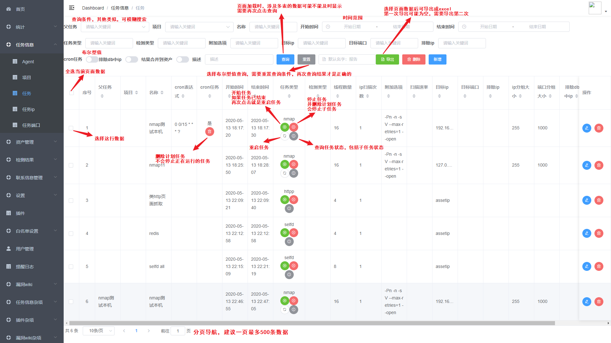

### 钉钉机器人推送

如果不需要测试实时消息推送，直接跳到**任务说明**

当前采用的是钉钉机器人群消息推送，由于发送频率限制，每条消息发送前休眠7秒

1. 新建钉钉群
2. 在桌面端钉钉，打开群设置，并新增自定义机器人（通过Webhook接入自定义服务）
3. 机器人名字随意填写，安全设置选 **加签**，密钥复制到前端**设置-通知设置-IM通知-秘钥**处
4. Webhook 地址复制到前端**设置-通知设置-IM通知-消息地址**处

配置成功后，需要开启通知才能推送漏洞消息，并且只有在风险等级里的风险才会提醒

### 任务说明

```
任务结果说明
各个任务，扫描后结果的具体位置
nmap/mass/mass2Nmap -> 资产管理-资产ip/资产端口/主机
selfd/nse -> 检测结果-检测结果
httpp -> 检测结果-web信息/web和url信息/url
```

1. 支持nmap、mass、mass2Nmap、nse、selfd、httpp六种任务类型

   | 任务类型  | 说明                                                         |
   | --------- | ------------------------------------------------------------ |
   | nmap      | 调用nmap执行端口扫描，支持udp协议端口入库；结果包含ip、端口、协议、状态、服务、版本等信息 |
   | mass      | 调用masscan执行端口扫描；结果包含ip、端口、协议、状态等信息  |
   | mass2Nmap | 先调用masscan执行端口扫描，再调用nmap对masscan扫描的结果进行端口详细信息扫描；结果包含ip、端口、协议、状态、服务、版本等信息 |
   | nse       | 调用nmap的nse插件进行安全检测，前端可以配置nse插件；结果包含ip端口、漏洞名称、插件名称、风险、检测结果等信息 |
   | selfd     | 调用自定义插件进行安全检测，前端暂时不能配置自定义插件；结果包含ip端口、漏洞名称、插件名称、风险、检测结果等信息 |
   | httpp     | 对：like http、为空、null、tcpwrapped、unknown、包含?的端口服务和版本，进行http页面爬取（非JS动态页面）；结果包含ip端口，web title，body内容，http头的server、xpoweredby、setcookie、认证方式，页面所有链接等信息 |

2. 支持nse、selfd、httpp三种指定任务的检测类型

   | 检测类型 | 说明                                                         |
   | -------- | ------------------------------------------------------------ |
   | nse      | nse检测任务与nse任务类似，只不过nse检测任务针对的是指定的任务 |
   | selfd    | selfd检测任务与selfd任务类似，只不过selfd检测任务针对的是指定的任务 |
   | httpp    | httpp检测任务与httpp任务类似，只不过httpp检测任务针对的是指定的任务 |

3. 任务可设置线程数量，单个ip扫描次数，ip分组大小，端口分组大小（仅限nmap全端口模式）

4. 可设置附加选项

5. 目标ip可设置指定ip，ip CIDR，ip地址段，排除ip与此类似

6. 目标端口可设置指定端口，端口范围

7. 可指定数据库中的资产ip为排除ip，不对数据中的资产ip进行扫描

8. 可设置定时任务，基于cron表达式的定时任务

### nmap扫描任务

新建nmap任务，目标ip为服务器本机地址127.0.0.1，全端口扫描


开始任务

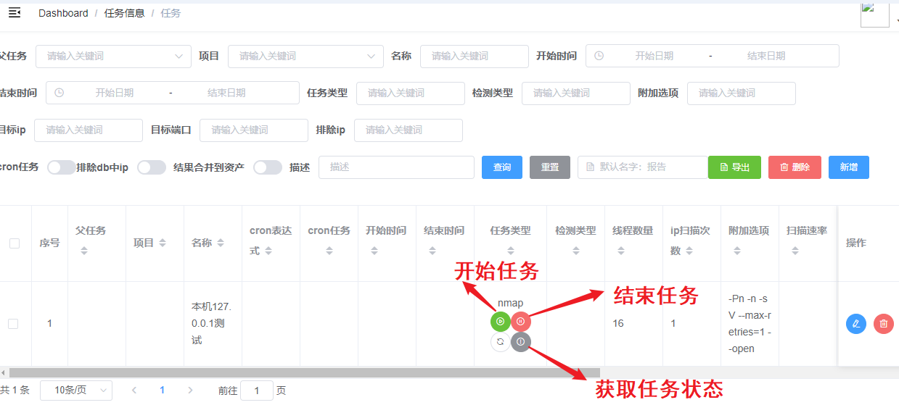

查看ip及端口信息

资产ip页面，编辑可以看到与当前ip相关的所有信息，包括 [资产ip, 资产端口, 主机信息,  漏洞检测结果, web信息, url信息]（如果有的话）

资产端口页面，编辑可以看到与当前端口相关的所有信息，包括 [资产ip, 资产端口, 主机信息, 漏洞检测结果, web信息, url信息]（如果有的话）


### selfd任务

新建selfd任务

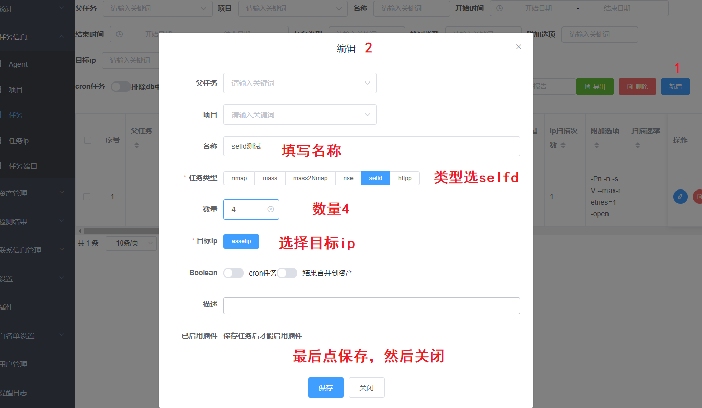

开始任务，同nmap任务一样操作

如果配置了钉钉群推送，漏洞信息会实时推送到群里

查看扫描结果

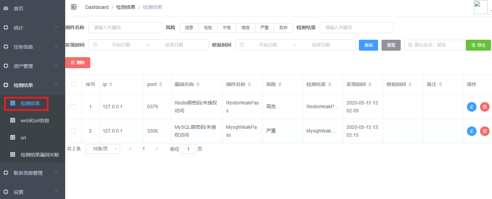

### httpp任务

新建httpp任务

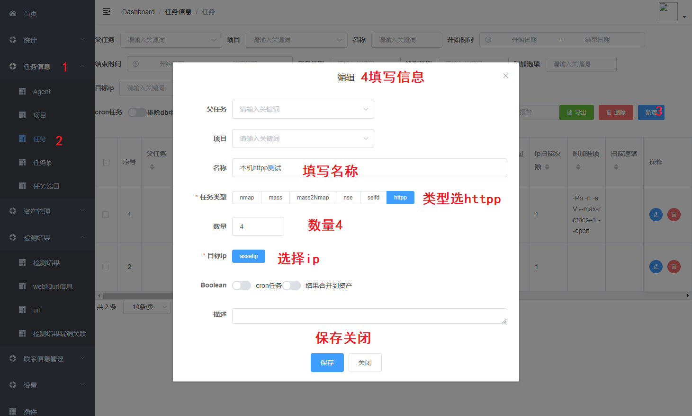

开始任务，同nmap任务一样操作

查看扫描结果

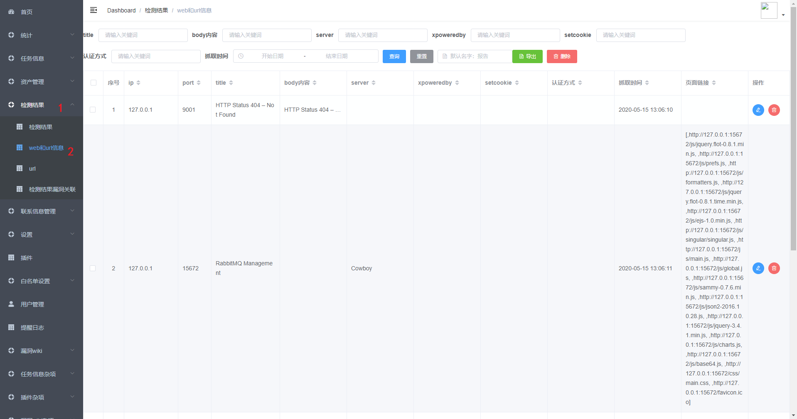

### 邮件资产报告/漏洞报告

1. 增加邮件配置

   前端**设置-通知设置-邮件通知-邮箱host**，填写host

   前端**设置-通知设置-邮件通知-账号**，填写账号

   前端**设置-通知设置-邮件通知-密码/授权码**，填写密码/授权码

   前端**设置-通知设置-邮件通知-提醒邮箱列表**，填写提醒邮箱列表

2. 修改定时任务

   前端**设置-定时任务-邮件资产报告**，增加邮件资产报告的cron表达式

   前端**设置-定时任务-邮件漏洞报告**，增加邮件漏洞报告的cron表达式

3. 之后等任务时间触发即可

## 部分功能截图

### 首页


### 统计

资产统计1

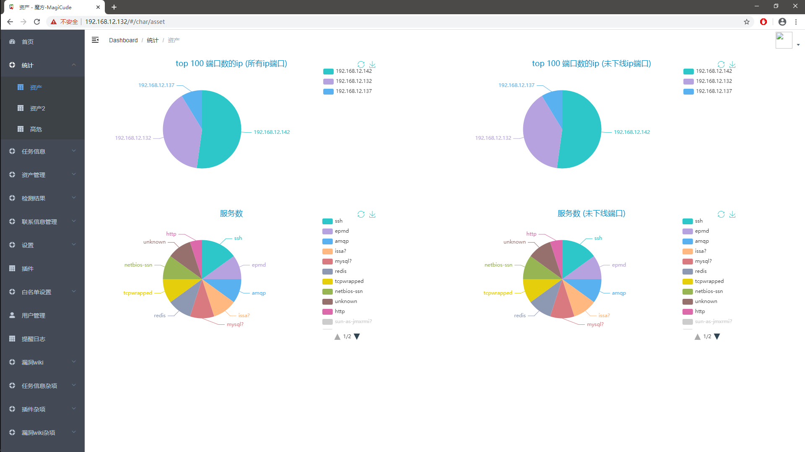

资产统计2

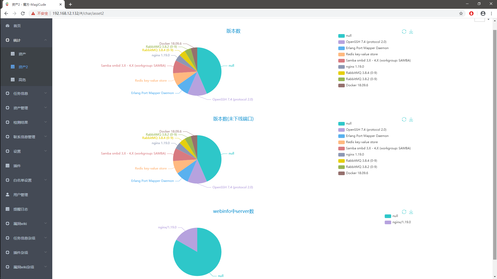

高危统计

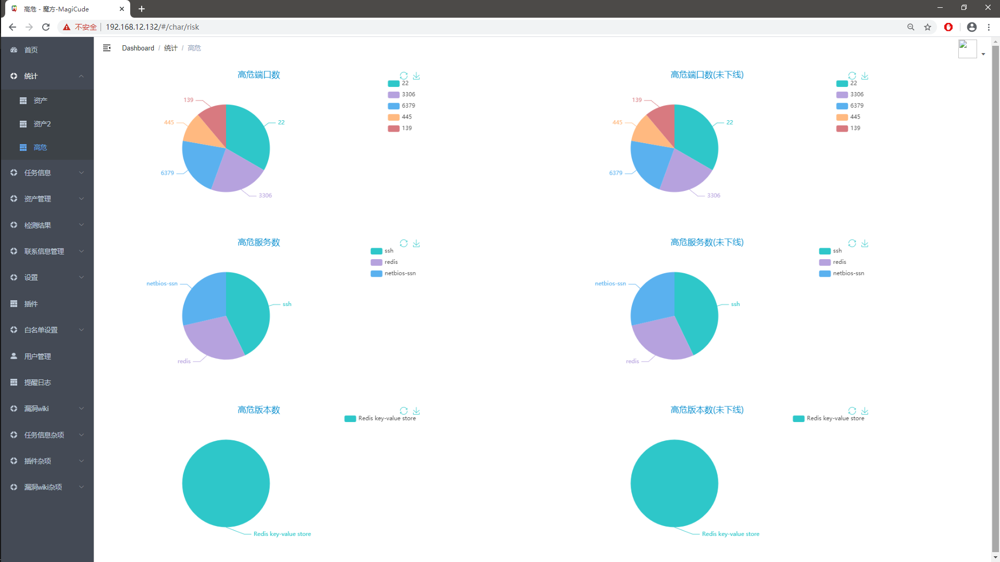

### 任务

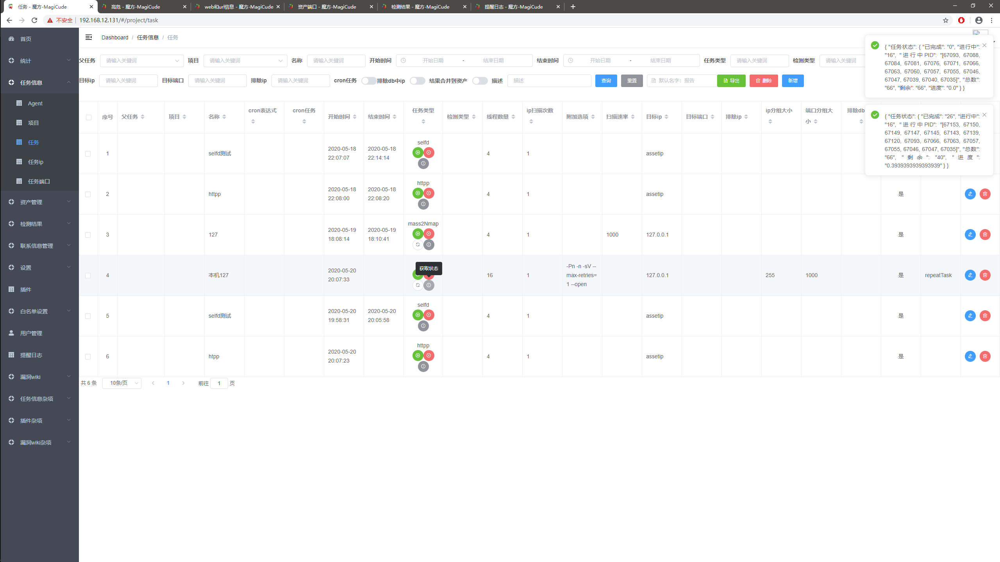

### 资产

资产ip所有信息

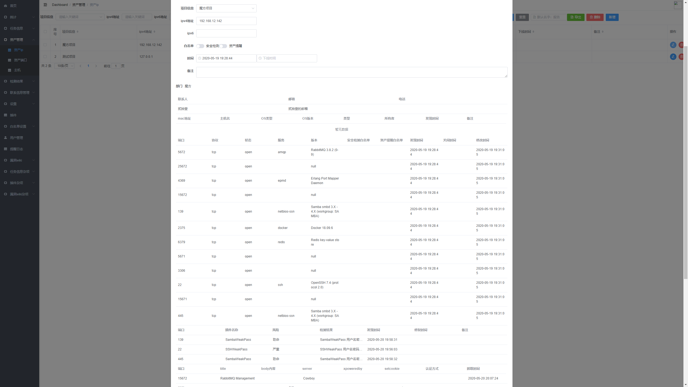

资产端口

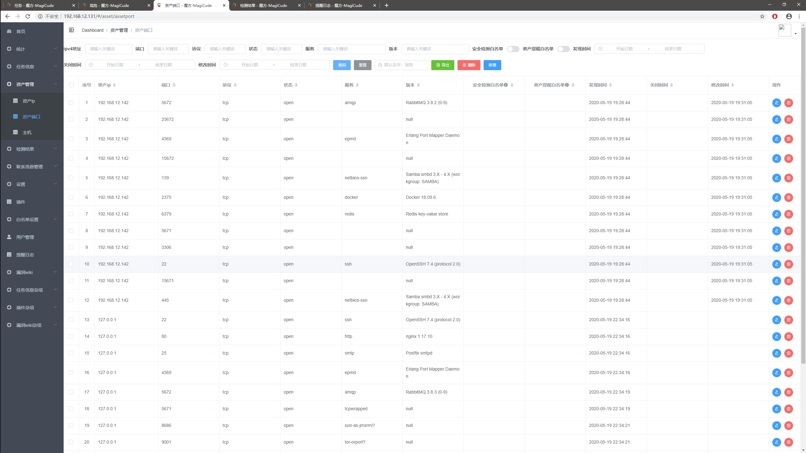

### 检测结果、提醒日志

web信息

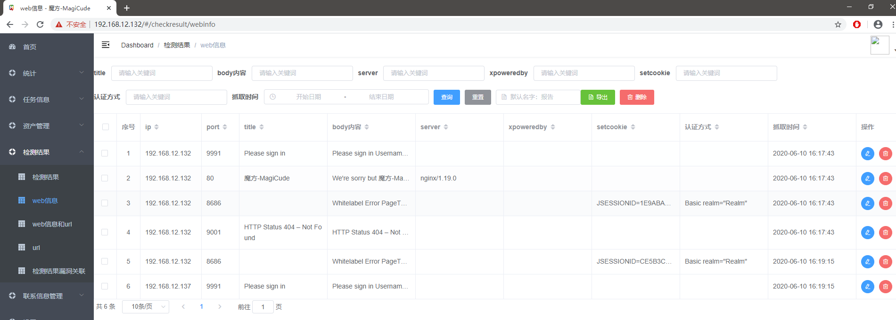

web信息和url

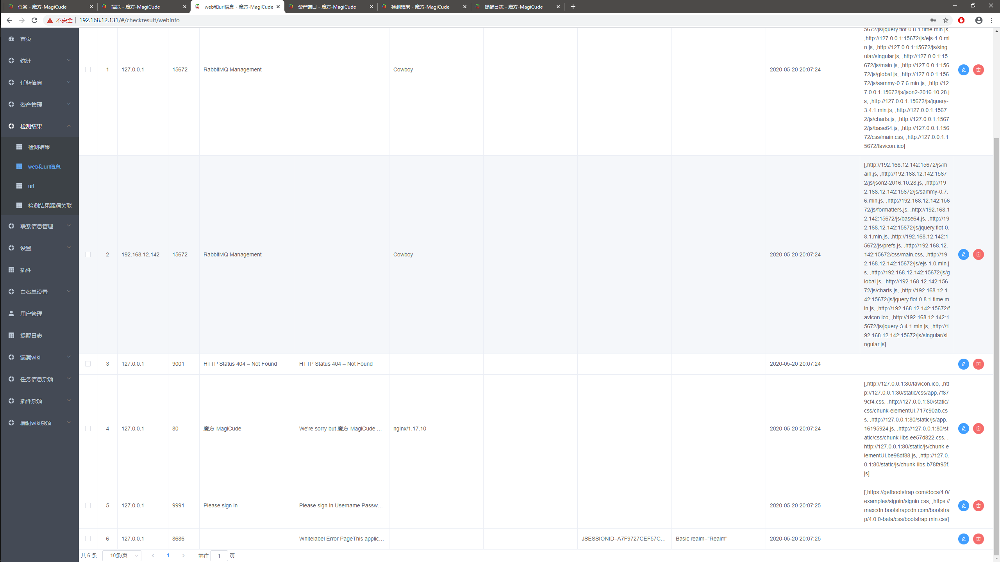

检测结果和提醒日志

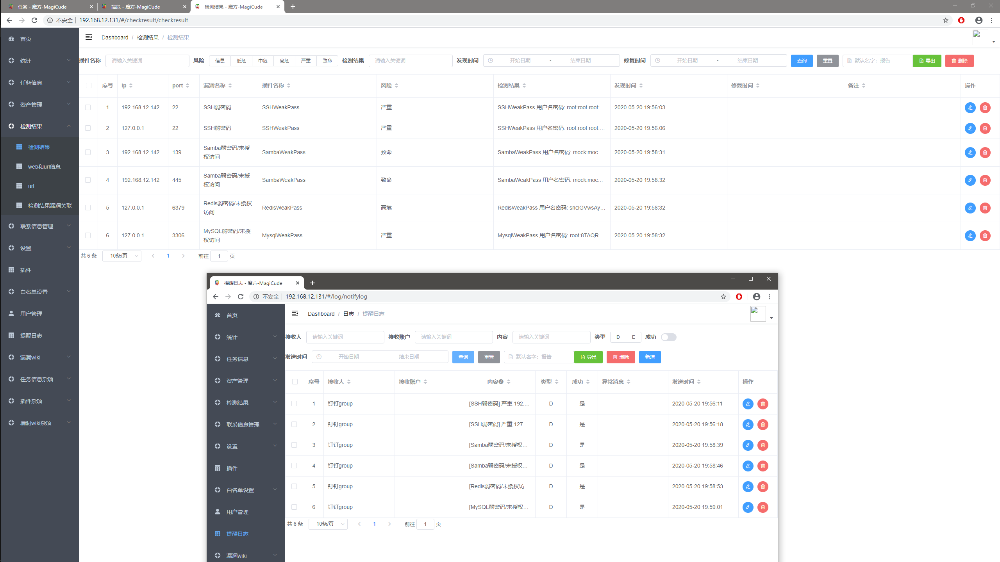

### 邮件报告及钉钉群推送

邮件所有资产报告（默认提醒邮箱），项目负责人只会收到属于自己项目的资产报告

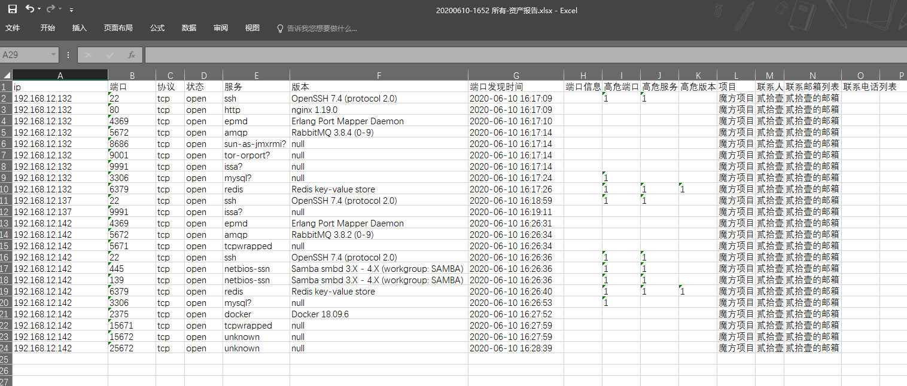

邮件所有漏洞报告（默认提醒邮箱），项目负责人只会收到属于自己项目的漏洞报告

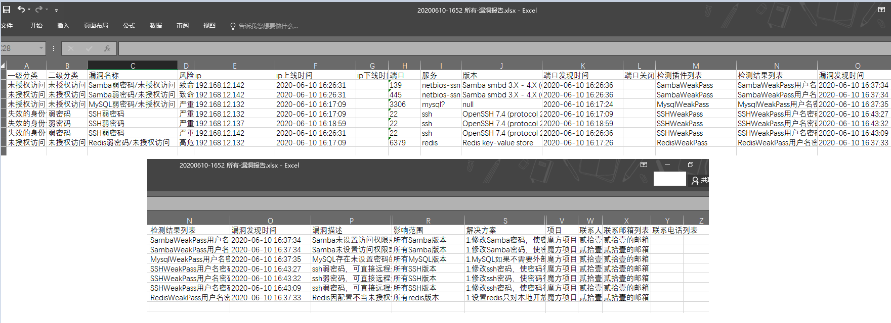

钉钉群推送

电脑客户端

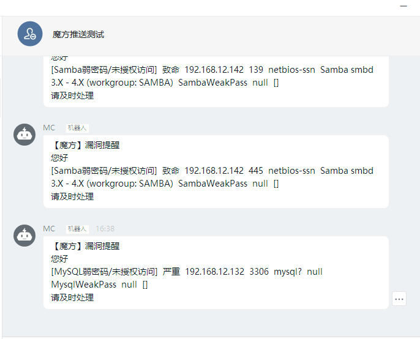

手机端


## 展望

1. 增加无回显插件检测
2. 漏洞实时推送私信负责人（我们内部实现了）
3. 优化新增自定义插件并丰富插件
4. 增加用户前端，放开漏洞wiki，还有啥？
5. 丰富漏洞wiki，建成知识库
6. 增加全局搜索
7. 增加资产导入接口，漏洞导入接口

## Q/A

1. Q：自定义插件与nse插件这么少，什么时候扩增？

   A：这个系统初衷其实就是资产收集，后面才慢慢增加插件功能，需要公测结束，系统稳定后或者优化新增自定义插件后，再慢慢增加插件。

2. Q：漏洞wiki太少，什么时候丰富起来？

   A：增加用户前端后，会考虑这个事，并且需要社区共同努力。

3. Q：能否接入其他开源漏扫插件？

   A：看需求，目前暂时没有这个计划。

4. Q：能否只用来做资产管理，不推送资产/漏洞报告，也不发钉钉群推送？

   A：可以的，部署后，不配置邮件和IM通知相关信息即可。

5. Q：什么时候开源？

   A：根据公测的结果和社区反馈来确定开源的时间。

**其他Q/A及更多功能，请查看公测文档**

## 微信公测组

如何参与公测，扫描下方二维码，关注公众号，回复**自己的微信号+魔方**，即刻拥有！


