# 魔方-MagiCude 使用说明

by [贰拾壹](https://github.com/er10yi )

赋予数据无限可能：分布式端口扫描、资产安全管理、实时威胁监控与通知、高效漏洞闭环、漏洞wiki、邮件报告通知、poc框架，and more!

## 前言

### 起名来源

三阶魔方的变化有```(8!*3^8*12!*2^12)/(3*2*2)=43,252,003,274,489,856,000``` 约等于4.3*10^19，即4325亿亿种变化，寓意数据也有无限种使用方式。

随着企业发展规模变大，企业拥有越来越多的服务器和虚拟服务器，安全人员每天耗费大量的精力在杂乱无章的资产上，但得到的结果是微乎其微，投入与产出不成正比。如何高效的获取服务器IP、端口信息、web信息、url链接、漏洞等资产信息，并对其进行有效的安全管理，如何建立漏洞wiki并自动闭环漏洞，减少安全部门与业务部门的沟通，如何及时发送资产信息和处理结果给负责人进行整改并自动确认整改完成，如何有效获取DHCP的办公机IP与用户关联，成为难题。

魔方-MagiCude给出了一个解决方案，魔方-MagiCude以下简称魔方。

### 技术栈及部分功能简介

技术栈

1. Spring boot 微服务架构，agent可分布式部署
2. Redis、Quartz、MySQL、RabbitMQ、Docker
3. VUE（前端模板基于https://github.com/PanJiaChen/vue-admin-template），其实有很大的改动
4. 图表统计基于echarts
5. JDK 15
6. python3.9

| 功能               | 详情                                                         |
| ------------------ | ------------------------------------------------------------ |
| 图表统计           | 1.折线图包括：<br/>资产ip、资产端口<br/>检测结果、高危资产<br/>2.饼图包括：<br/>检测结果数、检测结果数(未修复)<br/>top 100端口数(所有ip端口)、top 100端口数的ip(未下线ip端口)<br/>服务数、服务数(未下线端口)<br/>版本数、版本数(未下线端口)<br/>webinfo中server数<br/>高危端口数、高危端口数(未下线)<br/>高危服务数、高危服务数(未下线)<br/>高危版本数、高危版本数(未下线) |
| 任务管理           | 1.agent信息与心跳检测<br/>2.任务状态实时监控，任务操作       |
| 资产、检测结果管理 | 1.资产ip、端口<br/>2.内网主机信息<br/>3.插件检测结果<br/>4.web和url信息，包含http头信息 |
| 联系信息管理       | 1.部门管理<br/>2.项目信息管理<br/>3.联系人管理<br/>4.联系人项目信息管理 |
| 设置               | 1.批量导入<br/>2.定时任务<br/>3.钉钉群实时推送漏洞信息、资产及漏洞报告邮件通知<br/>4.ua及高危信息<br/>5.用户名密码字典<br/>6.多种白名单机制，可对ip、端口、web title、web页面url做白名单 |
| 插件管理           | nse插件，python插件，http json插件，java插件                 |
| 漏洞wiki           | 包含完整的漏洞描述和修复方案，后续将增加用户前端开放给项目组自行学习 |
| 其他功能           | 1.Agent基于nmap、masscan的端口扫描，center后续将提供api接入其他系统端口扫描结果及漏洞扫描结果。<br/>2.基于nse插件、自定义插件的安全扫描<br/>3.基于自定义http爬虫的http/https服务，类http服务，未知服务版本的web页面信息抓取，页面链接抓取<br/>4.基于RabbitMQ的任务分发和检测结果收集<br/>5.分布式agent<br/>6.漏洞实时提醒、汇总邮件提醒，资产汇总邮件提醒，可标记高危资产<br/>7.**双击```GenPass.bat```，一键初始化所有密码，杜绝默认密码** |

### 编码说明

所有内容编码均为utf-8

## 当前存在的问题

1. 登录口存在爆破
4. 未全部做数据合法性校验，所填数据要合法

## 部署

### 账号密码表格

deploy目录下双击```GenPass.bat```，相关密码会自动生成，并保存在newPass.txt，新的配置文件和启动脚本会自动复制到MagiCude目录

|     软件      |   账号   |     密码      |
| :-----------: | :------: | :-----------: |
|   RabbitMQ    | magicude | 见newPass.txt |
|     MySQL     |   root   | 见newPass.txt |
|     Redis     |          | 见newPass.txt |
|    Eureka     | magicude | 见newPass.txt |
| druid monitor | magicude | 见newPass.txt |
|     mail      | 前端设置 |   前端设置    |
|      key      |          | 见newPass.txt |
|   管理后台    | MagiCude | 见newPass.txt |

### 目录结构

```shell
deploy
│  GenPass.bat # Windows下用于执行GenPass.jar，*uinx直接执行GenPass.bat里面的内容就行了
│  GenPass.jar # 支持jre1.8+，用于生成新密码、配置文件、初始化脚本，并自动复制到MagiCude目录下
│  newPass.txt # 执行GenPass.jar后生成，各个软件的密码(包括管理后台)，请妥善保存
│
├─defaultConf # 默认配置文件夹
│      agent.yml # agentapp.jar运行的配置文件，下同
│      center.yml # centerapp.jar运行的配置文件，下同
│      eureka.yml # eurekaapp.jar运行的配置文件，下同
│      initAgentEnvironmentAndStart.sh # 用于初始化agent环境，多agent部署时用到，下同
│      initDataAndStart.sh # 用于初始化center数据并启动系统，下同
│      initCenterEnvironmentAndStart.sh # 用于初始化center环境和数据并启动系统，下同
│      initMySQL.sh # 用于初始化docker的MySQL，下同
│      initRMQ.sh # 用于初始化docker的RabbitMQ，下同
│      magicude # 简化版的操作脚本，用于系统启动后操作，start|stop|restart|status，下同
│      magicude.sql # 用于初始化数据库，下同
│      runAgent.sh # 用于启动agent，下同
│      stopAgent.sh # 用于停止agent，下同
│      util.sh # 包含环境变量，Python版本，java版本，日志打印
│      uninstall.sh # 卸载脚本
│
└─MagiCude # 部署需要的目录，包含初始化后的启动脚本和数据库文件，未说明的如上
    │  agent.yml ****执行GenPass.jar后生成****
    │  agentapp.jar # agent jar包
    │  center.yml ****执行GenPass.jar后生成****
    │  centerapp.jar # center jar包
    │  eureka.yml ****执行GenPass.jar后生成****
    │  eurekaapp.jar # eureka 注册中心jar包
    │  initAgentEnvironmentAndStart.sh ****执行GenPass.jar后生成****
    │  initDataAndStart.sh ****执行GenPass.jar后生成****
    │  initCenterEnvironmentAndStart.sh ****执行GenPass.jar后生成****
    │  initMySQL.sh ****执行GenPass.jar后生成****
    │  initRMQ.sh ****执行GenPass.jar后生成****
    │  runAgent.sh ****执行GenPass.jar后生成****
    │  stopAgent.sh ****执行GenPass.jar后生成****
    │  magicude ****执行GenPass.jar后生成****
    │  util.sh ****执行GenPass.jar后生成****
		│  uninstall.sh ****执行GenPass.jar后生成****
    ├─agent # agentapp.jar 启动后才会产生
    │  └─logs # agent的日志文件，如果启动失败，可查看error的日志
    ├─center # centerapp.jar 启动后才会产生
    │  └─logs # center 的日志文件，如果系统启动失败，可查看error的日志
    ├─report # 资产报告和漏洞报告
    │  ├─asset # 资产报告，系统启动后，发送资产报告之后才会产生
    │  └─vuln # 漏洞报告，系统启动后，发送漏洞报告之后才会产生
    │
    ├─db # 初始化后的数据文件
    │      magicude.sql ****执行GenPass.jar后生成****
    │
    ├─dist # 后台静态文件
    │  └─static
    │      │
    │      └─js
    │         app.8dd2740b.js # 前端API接口地址在这
    ├─nginx
    │      default.conf # docker nginx配置文件
    │
    └─operation # center的手动操作脚本，可以用magicude脚本替代，见上文
            checkDockerImageStatus.sh # 检查docker容器"nginxApp" "magicude_mysql" "magicude_redis" "magicude_rabbitmq"的运行状态，如果没有运行，会尝试重启一次
            dockerStopService.sh # 停止docker中的"nginxApp" "magicude_mysql" "magicude_redis" "magicude_rabbitmq"容器
            getStatus.sh # 获取center所有jar的运行状态
            restartAll.sh # kill掉nmap和masscan，重启docker容器，重启center所有服务：eurekaapp.jar centerapp.jar agentapp.jar
            runCenterService.sh # 启动center所有服务：eurekaapp.jar centerapp.jar agentapp.jar
            stopAll.sh # kill掉nmap和masscan，停止docker中的"nginxApp" "magicude_mysql" "magicude_redis" "magicude_rabbitmq"容器，停止center所有服务：eurekaapp.jar centerapp.jar agentapp.jar
            stopCenterService.sh # 停止center所有服务：eurekaapp.jar centerapp.jar agentapp.jar
```

### center与agent部署

### 生成配置文件

下载部署包（Releases页面）解压后，deploy目录下双击```GenPass.bat```（Windows下，*uinx/mac直接执行```GenPass.bat```里面的内容就行了），将在当前目录生成newPass.txt，新的配置文件和初始化脚本会自动复制到MagiCude目录下

#### center

1. 将```MagiCude```上传到服务器root目录下

2. 终端执行```sh initCenterEnvironmentAndStart.sh```，初始化环境和数据并启动系统，按提示选择center的ip即可


运行后会在当前目录生成一个center文件夹，里面是center的日志

发送邮件报告时，会在当前目录生成report文件夹，里面包含asset（资产报告）和vuln（漏洞报告）

docker的一些使用操作，现在不需要执行

```shell
# 删除镜像
docker rmi 镜像/镜像id
# 删除容器
docker rm 容器/容器id
# 启动容器
docker start 容器/容器id
# 停止容器
docker stop 容器/容器id
# 查看容器日志
docker logs -f 容器
# 重启docker
systemctl restart docker
```

#### agent

如果agent与center不在同一台服务器

1. agent服务器的root目录下新建```MagiCude```目录，将以下文件上传到```MagiCude```目录

```shell
agent.yml
agentapp.jar
initAgentEnvironmentAndStart.sh
runAgent.sh
stopAgent.sh
uninstall.sh
util.sh
```

2. 然后执行初始化agent环境并启动agent，按提示输入center的ip即可

```shell
sh initAgentEnvironmentAndStart.sh
```

3. 等待agent注册即可

运行后会在当前目录生成一个agent文件夹，里面是agent的日志

### 防火墙配置

#### 开启iptables

* 上述初始化脚本会关闭防火墙

```shell
echo "**********关闭防火墙**********"
systemctl stop firewalld.service # firewalld
systemctl disable firewalld.service # firewalld
systemctl stop iptables.service # iptables
systemctl disable iptables.service # iptables
```

* 如果是生产服务器，建议配置防火墙，以iptables为例，firewall自行搜索配置

1. 停用firewall，如果已是iptables，跳过此步骤

```shell
systemctl stop firewalld.service 
systemctl disable firewalld.service
firewall-cmd --state
```

2. 安装iptables，如果已安装，跳过此步骤

```shell
 yum -y install -y iptables iptables-services
 systemctl start iptables.service # 运行
 systemctl enable iptables.service # 开机启动
```

* 确认已成功运行

```shell
 service iptables status
```

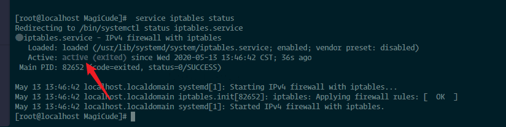

#### 运行的程序及端口

|       软件        |               端口               |   备注    |
| :---------------: | :------------------------------: | :-------: |
|   eurekaapp.jar   |               8686               |  服务器   |
|   centerapp.jar   |               9001               |  服务器   |
|   centerapp.jar   |                53                | 服务器dns |
|   agentapp.jar    |               9991               |  服务器   |
|  magicude_mysql   |               3306               |  docker   |
|  magicude_redis   |               6379               |  docker   |
| magicude_rabbitmq | 4369 5671 5672 15671 15672 25672 |  docker   |
|     nginxApp      |                80                |  docker   |

**注意：直接在服务器INPUT链上限制docker的端口是没用的，需要在docker的转发链上限制**

* 一些操作，这里不需要执行

```shell
iptables --line -nvL INPUT # 查看服务器防火墙规则
iptables -D INPUT num # 删除服务器防火墙第几num条规则（需要明确的数字）
service iptables save # 保存服务器防火墙规则
service iptables restart # 重启服务器防火墙

iptables -L DOCKER -n --line-number # 查询DOCKER表并显示规则编号
iptables -D DOCKER num # 删除DOCKER表第几num条规则（需要明确的数字）
```

#### center

```shell
# 这里是iptables的规则，agent的ip和本机出口ip按实际修改
# 1.禁止访问8686、9001、9991
iptables -I INPUT -p tcp --dport 8686 -j DROP -m comment --comment "禁止访问8686端口"
iptables -I INPUT -p tcp --dport 9001 -j DROP -m comment --comment "禁止访问9001端口"
iptables -I INPUT -p tcp --dport 9991 -j DROP -m comment --comment "禁止访问9991端口" # 如果center服务器上没有部署agent，这条不执行也可以
# 2.增加127.0.0.1对8686、9001、9991的访问
iptables -I INPUT -s 127.0.0.1 -p tcp --dport 8686 -j ACCEPT -m comment --comment "localhost对8686端口的访问"
iptables -I INPUT -s 127.0.0.1 -p tcp --dport 9001 -j ACCEPT -m comment --comment "localhost对9001端口的访问"
iptables -I INPUT -s 127.0.0.1 -p tcp --dport 9991 -j ACCEPT  -m comment --comment "localhost对9001端口的访问" # 如果center服务器上没有部署agent，这条不执行也可以
# 3.增加agent对8686端口的访问，如有多个agent，需要加多个
iptables -I INPUT -s agent 1的ip -p tcp --dport 8686 -j ACCEPT -m comment --comment "agent1对8686端口的访问"
iptables -I INPUT -s agent 2的ip -p tcp --dport 8686 -j ACCEPT -m comment --comment "agent2对8686端口的访问"
# 4.增加本机出口ip对8686、9001、9991的访问
iptables -I INPUT -s 本机出口ip -p tcp --dport 9001 -j ACCEPT -m comment --comment "本机出口ip对9001端口的访问"
iptables -I INPUT -s 本机出口ip -p tcp --dport 8686 -j ACCEPT -m comment --comment "本机出口ip对8686端口的访问"
iptables -I INPUT -s 本机出口ip -p tcp --dport 9991 -j ACCEPT -m comment --comment "本机出口ip对9991端口的访问" # 这条不加也行，agent只与center通信
service iptables save
service iptables restart

```

```shell
# 这里是iptables的DOCKER规则，本机出口ip和agent的ip按实际修改
# 需要保持Accept -> Reject -> docker Accept的顺序
# 1.docker启动所需软件
# 2.插入规则
iptables -I DOCKER -p tcp --dport 80 -j REJECT
iptables -I DOCKER -p tcp --dport 3306 -j REJECT
iptables -I DOCKER -p tcp --dport 25672 -j REJECT
iptables -I DOCKER -p tcp --dport 15672 -j REJECT
iptables -I DOCKER -p tcp --dport 15671 -j REJECT
iptables -I DOCKER -p tcp --dport 5672 -j REJECT
iptables -I DOCKER -p tcp --dport 5617 -j REJECT
iptables -I DOCKER -p tcp --dport 4369 -j REJECT
iptables -I DOCKER -p tcp --dport 6379 -j REJECT
iptables -I DOCKER -p tcp -m tcp -s 本机出口ip --dport 80 -j ACCEPT
iptables -I DOCKER -p tcp -m tcp -s 本机出口ip --dport 3306 -j ACCEPT
iptables -I DOCKER -p tcp -m tcp -s 本机出口ip --dport 6379 -j ACCEPT
iptables -I DOCKER -p tcp -m tcp -s 本机出口ip --dport 25672 -j ACCEPT
iptables -I DOCKER -p tcp -m tcp -s 本机出口ip --dport 15672 -j ACCEPT
iptables -I DOCKER -p tcp -m tcp -s 本机出口ip --dport 15671 -j ACCEPT
iptables -I DOCKER -p tcp -m tcp -s 本机出口ip --dport 5672 -j ACCEPT
iptables -I DOCKER -p tcp -m tcp -s 本机出口ip --dport 5617 -j ACCEPT
iptables -I DOCKER -p tcp -m tcp -s 本机出口ip --dport 4369 -j ACCEPT
iptables -I DOCKER -p tcp -m tcp -s agent 1的ip --dport 6379 -j ACCEPT
iptables -I DOCKER -p tcp -m tcp -s agent 1的ip --dport 25672 -j ACCEPT
iptables -I DOCKER -p tcp -m tcp -s agent 1的ip --dport 15672 -j ACCEPT
iptables -I DOCKER -p tcp -m tcp -s agent 1的ip --dport 15671 -j ACCEPT
iptables -I DOCKER -p tcp -m tcp -s agent 1的ip --dport 5672 -j ACCEPT
iptables -I DOCKER -p tcp -m tcp -s agent 1的ip --dport 5617 -j ACCEPT
iptables -I DOCKER -p tcp -m tcp -s agent 1的ip --dport 4369 -j ACCEPT
iptables -I DOCKER -p tcp -m tcp -s agent 2的ip --dport 6379 -j ACCEPT
iptables -I DOCKER -p tcp -m tcp -s agent 2的ip --dport 25672 -j ACCEPT
iptables -I DOCKER -p tcp -m tcp -s agent 2的ip --dport 15672 -j ACCEPT
iptables -I DOCKER -p tcp -m tcp -s agent 2的ip --dport 15671 -j ACCEPT
iptables -I DOCKER -p tcp -m tcp -s agent 2的ip --dport 5672 -j ACCEPT
iptables -I DOCKER -p tcp -m tcp -s agent 2的ip --dport 5617 -j ACCEPT
iptables -I DOCKER -p tcp -m tcp -s agent 2的ip --dport 4369 -j ACCEPT

```

#### agent

``` shell
# center的ip和本机出口ip按实际修改
# 1.禁止对9991的访问
iptables -I INPUT -p tcp --dport 9991 -j DROP
# 2.增加127.0.0.1对9991的访问
iptables -I INPUT -s 127.0.0.1 -p tcp --dport 9991 -j ACCEPT -m comment --comment "localhost对9991端口的访问"
# 3.增加center对9991的访问
iptables -I INPUT -s center的ip -p tcp --dport 9991 -j ACCEPT  -m comment --comment "center对9991端口的访问"
# 4.增加本机出口ip对9991的访问（其实没啥必要，agent只与center通信）
iptables -I INPUT -s 本机出口ip -p tcp --dport 9991 -j ACCEPT -m comment --comment "本机出口ip对9991端口的访问"
```

#### 参考

```shell
iptables --line -nvL INPUT # 查看服务器防火墙规则
```

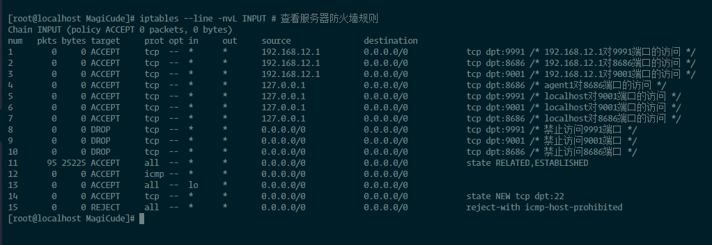

```shell
iptables -L DOCKER -n --line-number # 查询DOCKER表并显示规则编号
```

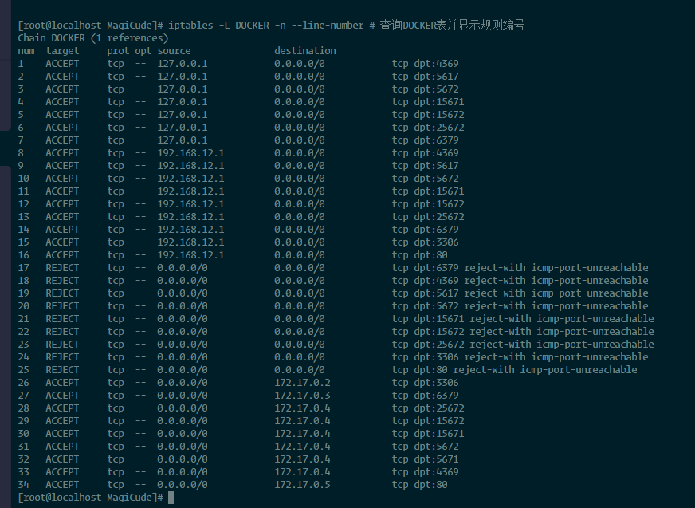

### Eureka确认服务已注册

访问http://192.168.12.128:8686/，使用Eureka的账号密码登录，确认服务已注册

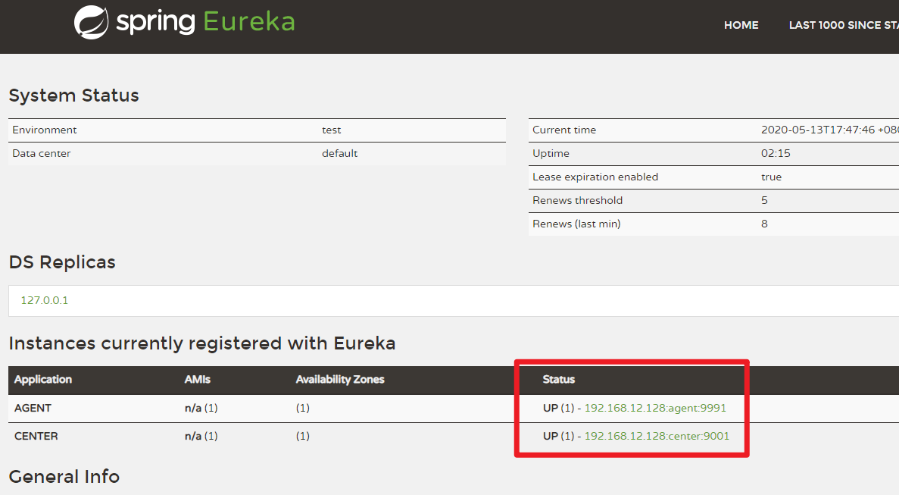

### 确认agent已在线

任务信息-Agent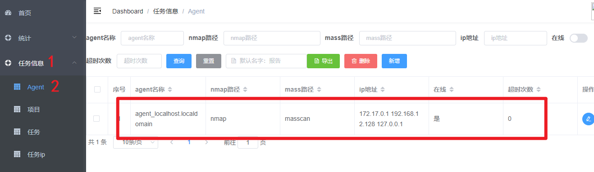

## 功能详细介绍及使用说明

访问服务器ip并登录，当前是http://192.168.12.128/

```
账号：MagiCude
密码：见newPass.txt
```

### 基本功能

基本的增删改查，页面数据导出等

批量导入功能在**设置-批量导入**

以**任务信息-任务**为例

#### 页面查询等操作


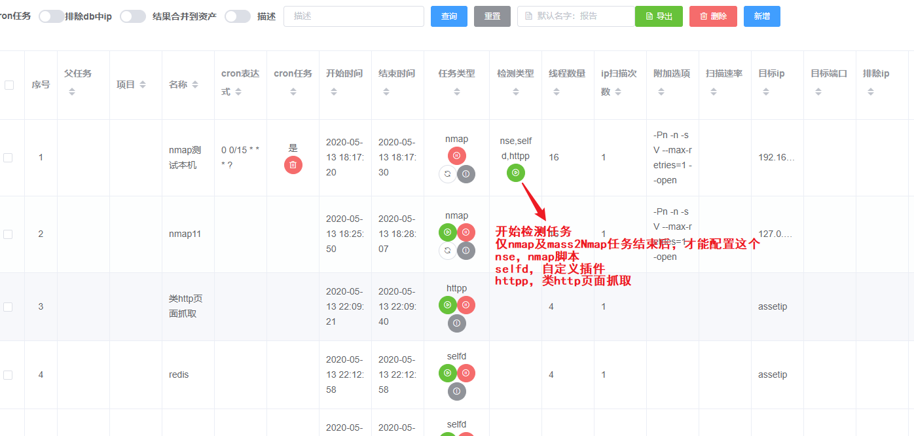

#### 页面新增/编辑

1. 新增，**如果输入框带搜索功能，需要手动选择之后才能新增，不然会新增空值**

   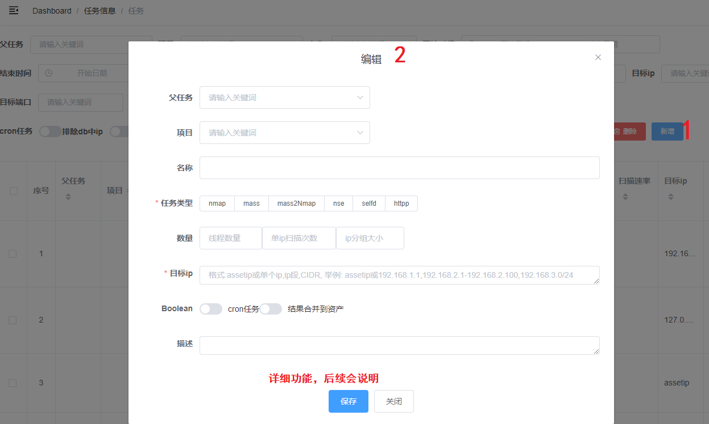

2. 编辑

   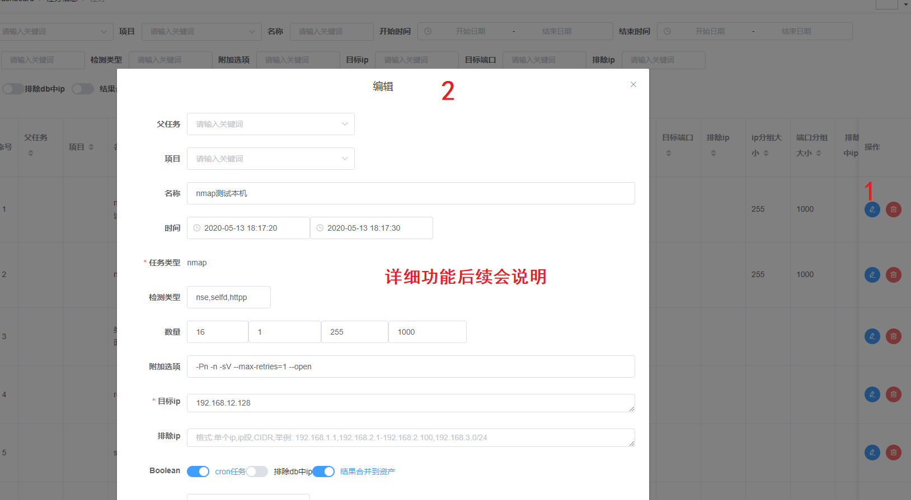

若无其他说明，每个页面基本功能基本如上述所示

删除会有确认框

### 首页及统计

首页有4个折线图和2个饼图，折线图数据每天早上六点统计一次，也可以前往**设置-统计报表数据**自定义设置统计频率，饼图数据每次查看都会查询数据库

```
资产ip、资产端口 折线图(如果没有数据则只有标题)
检测结果、高危资产 折线图(如果没有数据则只有标题)
检测结果数、检测结果数(未修复) 饼图(如果没有数据则只有标题，数据量太少的话实际分类可能有误差)
```

统计中的资产，资产2，高危与上述类似，都是各种饼图

### 任务信息

#### Agent

1. 可以查看系统当前的Agent信息，agent启动后会自动新增，不需要手动操作，可前往**设置-定时任务-agent心跳包监控**设置center发送心跳包的频率

2. Agent状态也可以前往注册中心查看，及上节**确认服务已注册**

3. 如果没有Agent在线，则无法执行任务

#### 项目

任务归属，与联系信息中的项目信息不同，联系信息中的项目信息是ip归属的项目信息

#### 任务

创建、执行、查看任务状态等

##### 新建任务格式说明

编辑/新增时，输入框会有具体的说明

再次强调，由于后端未全部做数据完整性校验，**数据格式需要遵循格式说明**

如果不明确默认值，可留空新增后查看，然后再重新编辑即可

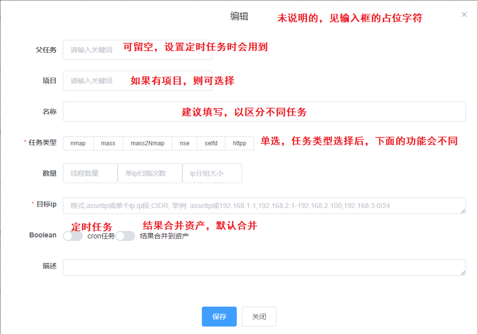

##### 新建任务

```
任务结果说明
各个任务，扫描后结果的具体位置
nmap/mass/mass2Nmap -> 资产管理-资产ip/资产端口/主机
selfd/nse -> 检测结果-检测结果
httpp -> 检测结果-web信息/web和url信息/url
```

1. 支持nmap、mass、mass2Nmap、nse、selfd、httpp六种任务类型

   | 任务类型  | 说明                                                         |
   | --------- | ------------------------------------------------------------ |
   | nmap      | 调用nmap执行端口扫描，支持udp协议端口入库；结果包含ip、端口、协议、状态、服务、版本等信息 |
   | mass      | 调用masscan执行端口扫描；结果包含ip、端口、协议、状态等信息  |
   | mass2Nmap | 先调用masscan执行端口扫描，再调用nmap对masscan扫描的结果进行端口详细信息扫描；结果包含ip、端口、协议、状态、服务、版本等信息 |
   | nse       | 调用nmap的nse插件进行安全检测，前端可以配置nse插件；结果包含ip端口、漏洞名称、插件名称、风险、检测结果等信息 |
   | selfd     | 调用自定义插件进行安全检测；结果包含ip端口、漏洞名称、插件名称、风险、检测结果等信息 |
   | httpp     | 对：like http、为空、null、tcpwrapped、unknown、包含?的端口服务和版本，进行http页面爬取（非JS动态页面）；结果包含ip端口，web title，body内容，http头的server、xpoweredby、setcookie、认证方式，页面所有链接等信息 |

2. 支持nse、selfd、httpp三种指定任务的检测类型

   | 检测类型 | 说明                                                         |
   | -------- | ------------------------------------------------------------ |
   | nse      | nse检测任务与nse任务类似，只不过nse检测任务针对的是指定的任务 |
   | selfd    | selfd检测任务与selfd任务类似，只不过selfd检测任务针对的是指定的任务 |
   | httpp    | httpp检测任务与httpp任务类似，只不过httpp检测任务针对的是指定的任务 |

3. 任务可设置线程数量，单个ip扫描次数，ip分组大小，端口分组大小（仅限nmap全端口模式）

4. 可设置附加选项

5. 目标ip可设置指定ip，ip CIDR，ip地址段，排除ip与此类似

6. 目标端口可设置指定端口，端口范围

7. 可指定数据库中的资产ip为排除ip，不对数据中的资产ip进行扫描

8. 可设置定时任务，基于cron表达式的定时任务

指定目标端口时，不能设置端口分组大小，两者冲突

设置定时任务时，可前往**设置-定时任务-cron表达式解析**解析cron表达式是否正确（只支持6位）

1. **新建namp任务**

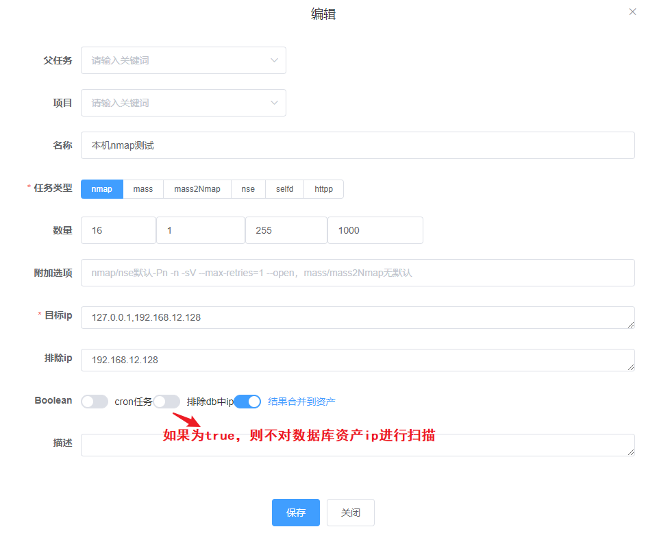

新建mass和mass2Nmap任务与此类似

2. **新建安全检测任务或对指定任务进行安全检测**

**注意：httpp任务没有插件**

* 新建安全检测任务，即对资产ip端口进行安全检测，已nse任务为例，selfd任务类似

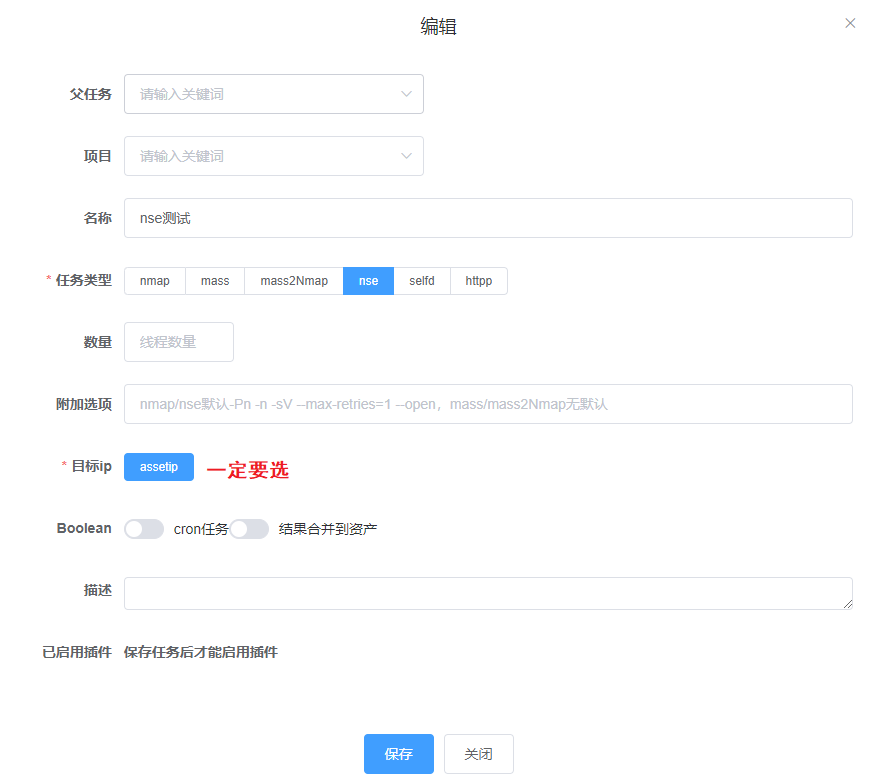

保存后才能选择插件

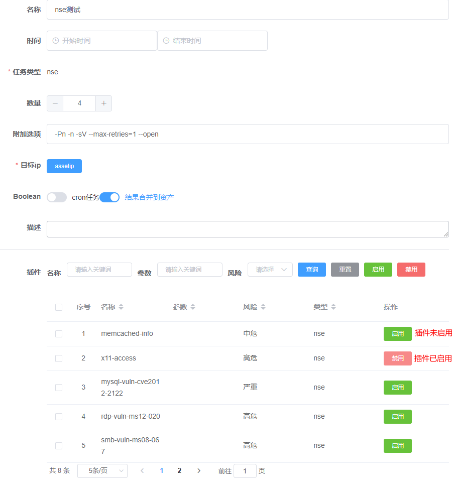

* 对指定任务进行安全检测，即对指定任务的任务ip端口进行安全检测任务

  只能对已结束的nmap、mass2Nmap任务进行检测，且开始执行后，会新建对应检测类型的子任务

#### 查看任务状态


只有nmap、mass、mass2Nmap任务有PID，其他没有

#### 任务ip端口

任务执行过程中ip端口记录，指定任务进行安全检测依赖这个

如没有指定任务安全检测需求，可以定时清空这两个表

### 资产管理

#### 资产ip

查看编辑资产ip信息

可查看指定ip的所有信息，包括部门, 项目信息, 联系人, 资产ip, 资产端口, 主机信息, 位置信息, 漏洞检测结果, web信息, url信息等信息（如果有的话）

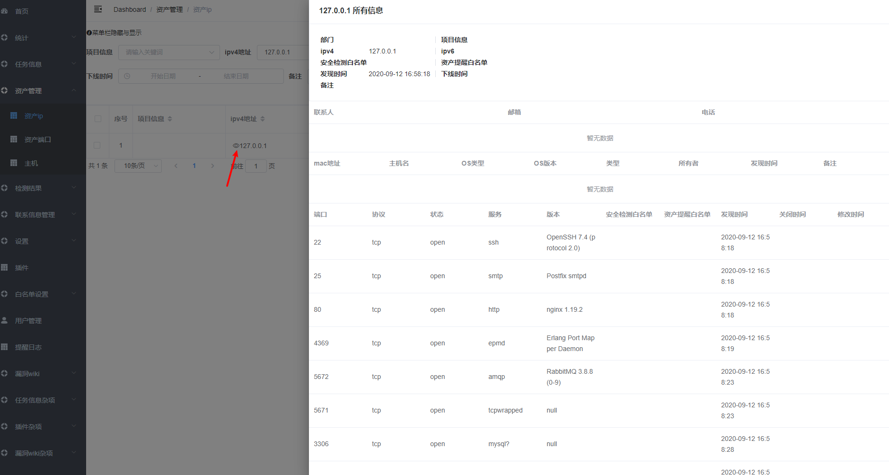

安全检测白名单：不会对该ip及ip的端口进行nse、selfd、httpp（端口扫描不受影响，如果不想扫描某个ip，需要加到任务的排除ip中）

资产提醒白名单：该ip及ip的所有端口，不提醒ip负责人（即使端口不在白名单），默认提醒不受限制

#### 资产端口

查看编辑资产端口信息

可查看指定ip的所有信息，包括部门, 项目信息, 联系人, 资产ip, 资产端口, 主机信息, 位置信息, 漏洞检测结果, web信息, url信息等信息（如果有的话）

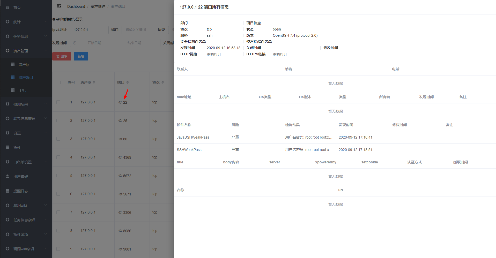

#### 主机

使用dns解析host信息，主要针对内网ip

```
mac地址、OS类型、OS版本、类型字段暂时没有使用
```

### 检测结果

#### 检测结果，漏洞关联

查看检测的漏洞信息，及检测结果对应的漏洞

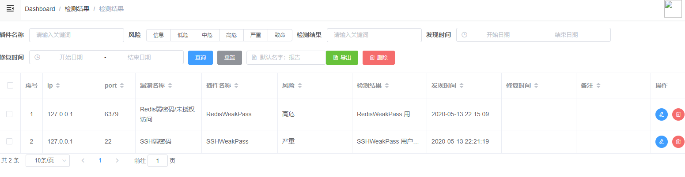


#### web和url信息，url

查看web和url信息时

* 如果title是已知的，可以到**白名单设置-标题**中加白，系统不会再抓取该title的body内容和页面链接

* 如果页面链接中包含已知域名，可以到**白名单设置-域名**中加白，则检测结果中的url不记录该链接

###  联系信息管理

可设置部门、联系人、项目信息、联系人项目信息关联

联系人，指的是项目的负责人

项目信息，指的是实际的项目（不是任务信息里的项目）

邮件发资产报告和漏洞报告依赖联系人信息和项目信息

如果一个ip没有对应的项目信息，则代表这个ip没有联系人

###  设置

#### 批量导入

**一次只能上传一个不超过3M的txt文件, 每行一条数据, 编码为utf-8**

**如果批量导入的数据包含```|```，则只能手动添加**

导入的数据需要符合以下格式，前端也有提示，可下载批量导入数据的模板或实际的数据进行导入

1. 部门项目信息联系人

   * 格式说明

   ```
   电话不能为空，如无电话，写暂无
   部门|项目信息|联系人|邮箱|电话
   测试部门|测试项目部|名字|邮箱|暂无
   ```

   * 实际格式参考

   ```
   部门|测试项目部|贰拾壹|test@test.com|1234567
   ```

2. 项目信息ip

   * 格式说明

   ```
   项目信息|ip
   项目信息|ip段
   项目信息|ip cidr
   ```

   * 实际格式参考

   ```
   魔方项目部|192.168.1.1
   测试项目|192.168.1.1-192.168.2.11
   测试项目|192.168.3.0/24
   ```

3. ip端口

   * 格式说明

   ```
   逗号后面没有空格
   如果要导入InterScanner的结果https://github.com/er10yi/InterScanner，需修改成当前格式
   ip[[端口,协议,状态,服务,版本],[端口,协议,状态,服务,版本]]
   ```

   * 实际格式参考

   ```
   192.168.1.1[[1111,tcp,open,service22,version],[2222,udp,open,ssh,sshversion]]
   ```

4. ip主机名

   * 格式说明

   ```
   ip不存在会新增
   ip:主机名信息
   ```
   
   * 实际格式参考
   
   ```
   192.168.1.1:work-testhostname.cor.com
   ```
   
5. 漏洞分类

   * 格式说明 

   ```
   如果没有二级分类，最后面的 : 也不能省略
   一级分类:二级分类1|二级分类2
   有二级分类：越权:水平越权|垂直越权
   无二级分类：拒绝服务:
   ```

   * 实际格式参考

   ```
   越权:水平越权|垂直越权
   拒绝服务:
   ```

6. 漏洞详情

   * 格式说明

   ```
   名称|描述|风险级别|参考|影响范围|一级分类名称|二级分类名称|漏洞示例代码|漏洞POC|修复方案|修复代码示例|修复配置示例|暂无
   ```

   * 实际格式参考

   ```
   SSH弱密码|ssh弱密码，可直接远程登录服务器，导致服务器被攻陷|严重||所有SSH版本|失效的身份认证|弱密码|||1.修改ssh密码，使密码符合公司密码复杂度要求，2.配置防火墙，只对业务ip开放ssh访问权限|||暂无
   ```

7. 插件配置

   * 格式说明

     可以导入多行插件（不含插件的代码selfd也可以），适用于多个服务，版本，关键字等

   ```
   风险: 信息, 低危, 中危, 高危, 严重, 致命
   如果暂时没有漏洞与插件对应，漏洞名称填默认，不然无法发漏洞报告
   名称|参数|风险|类型|超时|服务|版本|关键字|漏洞名称
   对应多个服务，版本，关键字，需要多条配置
   nse插件：smb-vuln-ms08-067||高危|nse||microsoft-ds||VULNERABLE|默认
   自定义(不包含代码，代码需要在selfd插件配置中导入)
   RedisInfo|info|高危|selfd|5000|redis|Redis key-value store|Server|Redis未授权访问
   RedisInfo|info|高危|selfd|5000|redis|Redis key-value store|Clients|Redis未授权访问
   RedisInfo|info|高危|selfd|5000|redis|Rdis key-value store|Stats|Redis未授权访问
   ```

   * 实际格式参考

   ```
   smb-vuln-ms08-067||高危|nse||microsoft-ds||VULNERABLE|默认
   SSHWeakPass|cat /etc/passwd|严重|selfd|3000|ssh|ssh|root|SSH弱密码
   SSHWeakPass|cat /etc/passwd|严重|selfd|3000|ssh|ssh|shutdown|SSH弱密码
   SSHWeakPass|cat /etc/passwd|严重|selfd|3000|ssh|ssh|nobody|SSH弱密码
   ```

8. selfd插件配置

   * 格式说明

   ```
   风险: 信息, 低危, 中危, 高危, 严重, 致命
   对应多个服务，版本，关键字，需要多条配置，如果暂时没有漏洞，漏洞名称填默认
   插件规范：模块只能import或者from开头，否则未安装的模块不会自动安装
   辅助验证类型: http,dns
   格式如下：
   名称|参数|风险|类型|辅助验证类型|超时|服务|版本|关键字|漏洞名称|（这里有个换行）
   插件代码
   ```

   * 实际格式参考

   ```python
   RedisInfo|info|高危|selfd||5000|redis|Redis key-value store|Server|Redis未授权访问|
   # -*- coding:utf-8 -*-
   import socket
   
   def start(ip, port, cmd, timeout, payload_map):
       password_list = payload_map.get('password')
   
       try:
           socket.setdefaulttimeout(int(timeout))
           for password in password_list:
               s = socket.socket(socket.AF_INET, socket.SOCK_STREAM)
               s.connect((ip, int(port)))
               s.send(('AUTH ' + password + '\r\n' + cmd + '\r\n').encode())
               byte_result = s.recv(1024)
               str_result = str(byte_result)
               if 'no password is set' in str_result:
                   return 'RedisWeakPass\nRedis未设置密码' + byte_result.decode()
               if '+OK' in str_result:
                   return 'RedisWeakPass\n密码：' + password + '\n' + byte_result.decode()
       except Exception:
           raise
   ```

9. ip端口白名单

   * 格式说明

   ```
   ip|端口|检测白名单|提醒白名单
   指定端口：192.168.1.1|3389|1|0
   不指定端口（对ip设置白名单）：192.168.1.1||1|0
   ```

   * 实际格式参考

   ```
   192.168.1.1|3389|1|0
   192.168.2.1||1|0
   ```

10. 项目信息端口白名单

    * 格式说明

    ```
    对项目下的ip和ip端口进行白名单
    项目名称|端口|检测白名单|提醒白名单
    指定端口：测试项目|3333|0|1
    不指定端口（对整个项目设置白名单）：测试项目||0|1
    ```

    * 实际格式参考

    ```
    测试项目|3333|0|1
    魔方项目||0|1
    ```
    
11. 域名白名单

    * 格式说明
    
    ```
    实际的域名，如果是根域名，则包含根域名的链接都不会记录
    qq.com
    www.baidu.com
    ```
    
    * 实际格式参考
    
    ```
    qq.com
    www.baidu.com
    ```

11. 标题白名单

    * 格式说明

    ```
    实际的web title，包含该字符的title的web相关信息不记录
    Welcome to nginx
    Apache Tomcat
    ```

    * 实际格式参考

    ```
    Welcome to nginx
    Apache Tomcat
    ```

12. ua

    httpp任务和http json插件agent会随机取ua

    * 实际格式参考

    ```
    Mozilla/5.0 (Windows NT 6.1; Win64; x64) AppleWebKit/537.36 (KHTML, like Gecko) Chrome/73.0.3683.103 Safari/537.36 OPR/60.0.3255.84
    ```

13. 高危端口

    * 格式说明

    ```
    实际的端口，资产报告会根据这个标记高危端口，统计-高危信息由这个得出
    22
    23
    ```

    * 实际格式参考

    ```
    22
    23
    6379
    ```

14. 高危服务

    * 格式说明

    ```
    具体的服务，资产报告会根据这个标记高危服务，统计-高危信息由这个得出
    ssh
    redis
    ```

    * 实际格式参考

    ```
    ssh
    redis
    ```

15. 高危版本

    * 格式说明

    ```
    具体的版本，资产报告会根据这个标记高危版本，统计-高危信息由这个得出
    Redis key-value store
    Redis key-value store 5.0.8
    Memcached
    ```

    * 实际格式参考

    ```
    Redis key-value store
    Redis key-value store 5.0.8
    Memcached
    ```

16. 字典用户名

    * 格式说明

    ```
    字典用户名，所有weakPass插件都会用到
    admin
    root
    ```

    * 实际格式参考

    ```
    admin
    root
    ```

17. 字典密码

    * 格式说明

    ```
    字典密码，所有weakPass插件都会用到
    admin
    toor
    ```

    * 实际格式参考

    ```
    admin
    toor
    ```

#### 定时任务

支持六位cron表达式模拟解析，也可用来查看系统时间是否正确

|        任务        | 说明                                                         |
| :----------------: | :----------------------------------------------------------- |
|    任务状态监控    | 监控系统所有任务状态，用于更新任务结束时间，刷新任务的redis缓存 |
|  agent心跳包监控   | 监控agent在线状态，刚启动系统或新增agent时，如果agent没有在线，可以设置较短的时间，正常后再恢复 |
|    邮件资产报告    | 向项目负责人和默认提醒邮箱发资产报告                         |
|    邮件漏洞报告    | 向项目负责人和默认提醒邮箱发漏洞报告                         |
| 每天执行一次的任务 | dns解析获取hostname<br/>nse结果获取hostname<br/>根据ip更新白名单<br/>根据项目更新白名单 |
|    统计报表数据    | 首页折线图所依赖的数据                                       |

#### 通知设置

##### 项目组邮件接收漏洞的风险等级

邮件漏洞报告只包括在风险等级中的漏洞，如果不想让项目组收到邮件，将风险等级清空即可

##### IM通知

当前采用的是钉钉机器人群消息推送，由于发送频率限制，每条消息发送前休眠7秒

1. 新建钉钉群
2. 在桌面端钉钉，打开群设置，并新增自定义机器人（通过Webhook接入自定义服务）
3. 机器人名字随意填写，安全设置选 **加签**，密钥复制到前端**设置-通知设置-IM通知-秘钥**处
4. Webhook 地址复制到前端**设置-通知设置-IM通知-消息地址**处

配置成功后，需要开启通知才能推送漏洞消息，并且只有在风险等级里的风险才会提醒

##### 邮件通知

1. 增加邮件配置

   前端**设置-通知设置-邮件通知-邮箱host**，填写host

   前端**设置-通知设置-邮件通知-账号**，填写账号

   前端**设置-通知设置-邮件通知-密码/授权码**，填写密码/授权码

   前端**设置-通知设置-邮件通知-提醒邮箱列表**，填写提醒邮箱列表

2. 修改定时任务

   前端**设置-定时任务-邮件资产报告**，增加邮件资产报告的cron表达式

   前端**设置-定时任务-邮件漏洞报告**，增加邮件漏洞报告的cron表达式

3. 之后等任务时间触发即可

非自建邮服可能有发信频率限制，没实际测

提醒邮箱列表为默认提醒邮箱，接收所有的资产报告（包括在提醒白名单中的）

漏洞报告只接收在风险等级中的

#### 其他设置

域名白名单（如果web页面的链接在域名白名单中，则检测结果中的url不记录该链接），标题白名单（如果web页面的title在标题白名单中，则检测结果中的web信息不记录该页面的body内容），ua（httpp任务和HTTP json插件会随机取ua），高危端口，高危服务，高危版本，字典用户名，字典密码

###  插件

插件类型：

1. nse插件，可前端新增，需要自己配置
2. java自定义插件，无法前端新增，只能后端新增后，重新编译jar包
3. python3自定义插件，可前端新增，需要自己配置，或下载最新的**插件配置.txt**导入
4. json格式插件（使用http/https方式访问的插件，插件名需要以HTTP开头），可前端新增，需要自己配置，或下载最新的**插件配置.txt**导入

说明：

2. 插件建议仔细阅读插件说明，并本地测试过实际的ip后，再新增

3. 插件也可以从批量导入新增

4. 插件的风险要与漏洞wiki中的风险一致

5. nse插件和自定义插件可以重复
6. 一个插件只能对应一个漏洞，否则导出报告sql语句会出错，
   虽然数据库设计是多对多的...
   比如，xxxWeakPass，对应两个漏洞
8. weakPass所用的账号密码在**设置-字典用户名/字典密码中设置**

* nse

  |          插件           |        漏洞名称        |
  | :---------------------: | :--------------------: |
  |     memcached-info      |  Memcached未授权访问   |
  |  mysql-empty-password   | MySQL弱密码/未授权访问 |
  | mysql-vuln-cve2012-2122 |          默认          |
  |    rdp-vuln-ms12-020    |          默认          |
  |       redis-info        | Redis弱密码/未授权访问 |
  |    smb-vuln-ms08-067    |          默认          |
  |    smb-vuln-ms17-010    |          默认          |
  |       x11-access        |          默认          |

* java selfd自定义插件

  |        插件         |            漏洞名称            |
  | :-----------------: | :----------------------------: |
  |     JavaFTPWeakPass     |      FTP弱密码/未授权访问      |
  |  JavaMemcachedStats |      Memcached未授权访问       |
  |    JavaMongoDbListDb    |       MongoDB未授权访问        |
  | JavaMsSqlServerWeakPass | MS SQL Server弱密码/未授权访问 |
  |    JavaMysqlWeakPass    |     MySQL弱密码/未授权访问     |
  |  JavaNginxVerDetect | Nginx版本低于最新版/已不受支持 |
  |  JavaOracleWeakPass |    Oracle弱密码/未授权访问     |
  | JavaPostgresSqlWeakPass |  PostgreSQL弱密码/未授权访问   |
  |    JavaRedisWeakPass    |     Redis弱密码/未授权访问     |
  |    JavaSambaWeakPass    |     Samba弱密码/未授权访问     |
  |     JavaSSHWeakPass     |           SSH弱密码            |
  |    JavaZookeeperEnvi    |      Zookeeper未授权访问       |

  **注意：OracleWeakPass插件会导致oracle账户锁定...建议不要在生产环境使用**
  
* python3 selfd自定义插件

  |        插件         |            漏洞名称            |
  | :-----------------: | :----------------------------: |
  |     FTPWeakPass     |      FTP弱密码/未授权访问      |
  |   MemcachedStats    |      Memcached未授权访问       |
  |    MongoDbListDb    |       MongoDB未授权访问        |
  |    MysqlWeakPass    |     MySQL弱密码/未授权访问     |
  |   NginxVerDetect    | Nginx版本低于最新版/已不受支持 |
  |    RedisWeakPass    |     Redis弱密码/未授权访问     |
  |     SSHWeakPass     |           SSH弱密码            |
  |    ZookeeperEnvi    |      Zookeeper未授权访问       |

* json selfd自定义插件（插件名需以HTTP开头）

  |          插件           | 漏洞名称 |
  | :---------------------: | :------: |
  | HTTPElasticsearchUnauth |   默认   |


#### python3插件编写说明

1. 可以在**selfd插件配置**批量导入

2. 模块导入说明，模块只能import或者from开头，否则未安装的模块不会自动安装

   如：import socket

   或：from pexpect import pxssh

3. python插件未安装的模块，会自动从以下源获取安装，最后一次会尝试默认源

   ```
   https://pypi.douban.com/simple/
   https://pypi.mirrors.ustc.edu.cn/simple/
   https://pypi.tuna.tsinghua.edu.cn/simple/
   https://pypi.hustunique.com/
   https://mirrors.aliyun.com/pypi/simple/
   ```

4. payloadMap：```Map<String, List<String>> payloadMap```

5. 插件名称必须包含WeakPass，才有

   ```python
   username_list = payload_map.get('username')
   password_list = payload_map.get('password')
   ```

6. 辅助验证为http：

   ```python
   http_validate_list = payload_map.get('http_validate')
   http_validate = http_validate_list[0]
   ```

7. 辅助验证为dns：

    ```python
    dns_validate_list = payload_map.get('dns_validate')
    dns_validate = dns_validate_list[0]
    ```

#### json插件编写说明

1. 可以在**selfd插件配置**批量导入，json写在插件代码中
2. 没想好json怎么格式化，先暂且用python的
3. 使用http/https方式访问的插件，插件名需要以HTTP开头
4. 其他信息填写在插件代码里，与Python3插件类似

支持```get、post、put、delete、patch、head、options、trace```方法，目前只测试了get和post

格式说明如下：

```json
http or https get
{
    "protocol":"http", # 只能是http或者https
    "method":"get", # 可以是 get、post、put、delete、patch、head、options、trace
    "url":"/info.php?id=1&user=test",
    headers:{
            "host":"127.0.0.1",
      			"User-Agent":"Mozilla/5.0 (Windows NT 10.0; Win64; x64) AppleWebKit/537.36 (KHTML, like Gecko) Chrome/60.0.3100.0 Safari/537.36", # UA不配置，则会从ua表中随机
            "Content-Type":"text/plain"
    }
}

http or https post
{
    "protocol":"http",
    "method":"post",
    "url":"/info.php?id=1&user=test",
    headers:{
            "host":"127.0.0.1",
            "Content-Type":"text/plain" # 常规参数
    },
    data:{
        "username":"test",
        "password":"passwd"
    }
}

http or https post
{
    "protocol":"http",
    "method":"post",
    "url":"/info.php",
    headers:{
            "host":"127.0.0.1",
            "Content-Type":"application/json" # json参数
    },
    data:{
        "username":"test",
        "password":"passwd"
    }
}

others
{
    "protocol":"http",
    "method":"delete",
    "url":"/info.php?id=1",
    headers:{
            "host":"127.0.0.1",
            "Content-Type":"text/plain"
    }
}
```

###  白名单设置

都可以批量导入

如果要对项目信息设置白名单，不建议对高危端口设置

###  用户管理

默认用户为管理员用户，普通用户不能访问用户管理的数据（可以点进前端，懒得在前端判断权限了）

其他没什么不同

头像地址暂时用不上

###  提醒日志

只包括项目负责人和钉钉群消息实时推送的日志

###  漏洞wiki

计划用来给项目组查看的漏洞wiki，减少沟通，提高效率，不过还没写用户前端

默认分类和默认漏洞不能删除，默认存在的意义：可以新增一个插件暂时不用写漏洞wiki，将插件的信息指向默认既可，上述已有说明

###  其他杂项配置

#### 任务信息杂项

与任务相关的一些多表

####  插件杂项

与插件相关的一些多表

漏洞wiki中的风险要与插件的风险一致

####  漏洞wiki杂项

与漏洞wiki相关的一些多表

## 注意事项

1. 目标ip为ipNoPort、unknownPortSerVer、ipAllPort的这三个任务尽量不要同时启动，因为都涉及对数据库大量查询
2. mass2Nmap任务状态，mass未完成时，为mass的状态，mass完成后为nmap的状态
3. 目标数较多和涉及对数据库大量查询的任务，需要时间处理目标，点击开始后，等待系统处理即可，页面可能会超时（但任务已执行），请勿多次点击开始，否则将会开启多个任务
4. selfd、httpp任务中途停止后，仍然会有线程残留，因为没有线程的pid，只是结束了线程池...
5. OracleWeakPass插件会导致oracle账户锁定...建议不要在生产环境使用
6. 其他注意事项，遵循之前章节里描述的

## 展望

1. 增加用户前端，放开漏洞wiki，还有啥？

2. 丰富漏洞wiki，建成知识库

3. 增加全局搜索

4. 增加资产导入接口，漏洞导入接口

## Q/A

1. Q：自定义插件与nse插件这么少，什么时候扩增？

   A：这个系统初衷其实就是资产收集，后面才慢慢增加插件功能，需要公测结束，系统稳定后或者优化新增自定义插件后（公测版 V1.3.25 - 20200913已优化新增自定义插件），再慢慢增加插件。

2. Q：漏洞wiki太少，什么时候丰富起来？

   A：增加用户前端后，会考虑这个事，并且需要社区共同努力。

3. Q：能否接入其他开源漏扫插件？

   A：看需求，目前暂时没有这个计划。

4. Q：功能点太多，不想看，任务配置太复杂，有没有简单的方式？

   A：暂时没有简单的方式，需要慢慢熟悉使用步骤，不明白的地方可以看使用说明或公测群里反馈。

5. Q：能否只用来做资产管理，不推送资产/漏洞报告，也不发钉钉群推送？

   A：可以的，部署后，不配置邮件和IM通知相关信息即可。

6. Q：nmap或masscan任务，长时间运行后查看状态时，没有进行中的pid，任务也没有继续运行，登录服务器执行dmesg命令显示nf_conntrack: table full, dropping packet 怎么办？

   A：优化netfilter。

7. Q：线程数量可不可以设置100或1000？

   A：不建议设置过大的线程数量，每个任务都会开一个线程数量大小的线程池，自行测试后，按需配置每个任务的线程数量大小。

8. Q：每个任务的cron表达式怎么设置才是最好？

   A：建议每个类型的任务，手动执行之后，判断所需时间，如果是单个agent，周期大于所需时间即可，如果部署多个agent，则多个任务扫描周期可以覆盖。

9. Q：插件扫描任务，任务状态一直剩余1或者2，没有结束，怎么办？

   A：有可能是启用了FTPWeakPass插件，此时可能任务没法自动结束，如果任务长时间没有结束，需要手动结束，建议FTPWeakPass插件单独开一个任务。

10. Q：检测结果如何实时推送项目负责人？

    A：暂时没有研究钉钉私信接口，目前仅实现了群机器人推送，且只能@全员。

11. Q：页面上有些数据无法显示怎么办？

    A：涉及多表数据查询，比如任务配置插件时，需要手动点显示插件按钮，插件名称才会显示；查看资产端口时需要浏览器窗口变化前端才会加载资产ip或者再次查询，其他与此类似。

12. Q：为啥1个小时会话就失效了，要重新登录？

    A：登录功能基于JWT，center.yml中jwt的ttl为1个小时，可以手动设置增大ttl，修改配置文件需要重启jar包。

13. Q：什么时候开源（20200925）？

    A：根据公测的结果和社区反馈来确定开源的时间。

14. Q：初始化脚本执行完或虚拟机中部署挂起后，无法访问？

    A：1.执行magicude status 查看服务是否正常；2.查看center的error日志；3.检查服务器防火墙规则。

15. Q：系统已经启动，但是忘记修改前端api地址，访问ip，登录提示Network Error 怎么办？

    A：浏览器F12，查看登录请求访问的地址是否127.0.0.1，如果是，则前端api地址没有修改，将修改api地址后的app.xxx.js覆盖服务器上MagiCude\dist\static\js\app.xxx.js的文件，之后执行```docker restart nginxApp```重启nginxApp即可，此时浏览器需要清除缓存或新开一个隐私窗口访问，登录请求的地址才是修改后的；如果登录请求访问的地址不是127.0.0.1，已经是服务器ip，请参照Q14。
    
16. Q：一键部署脚本initCenterEnvironmentAndStart.sh成功执行，但是访问前端登录时提示Network Error，查看center的error日志，发现java.sql.SQLSyntaxErrorException: Unknown database 'magicude'异常，怎么办？

    A：初始化数据的脚本没有复制到docker，需要重新执行```initCenterEnvironmentAndStart.sh```脚本；或者先停止center服务``` sh operation/stopCenterService.sh```，然后执行```sh initDataAndStart.sh ```。

17. Q：启动系统后，访问Eureka，agent服务已经注册，但是后台Agent页面没有看到新增Agent，且无法执行任务，怎么办？

    A：center默认5分钟发一次心跳包，最多可能需要等5分钟，才能看到agent上线；如果不想等，可以到**设置-定时任务**将a**gent心跳包监控**的cron表达式改成一分钟，即```0 0/1 * * * ?```，agent上线后再修改回正常```0 0/5 * * * ?```。

18. Q：不想给项目负责人邮件发漏洞报告，怎么办？

    A：将**设置-通知设置-风险等级**设置为空即可，此时项目组邮件不会收到漏洞报告。

19. Q：怎么才能知道自己写的或网上找的cron表达式，是否能运行？

    A：**设置-定时任务-cron表达式解析**，支持6位cron表达式。

## 微信讨论组

扫描下方二维码，关注公众号，回复**自己的微信号+魔方**，即刻拥有！


 