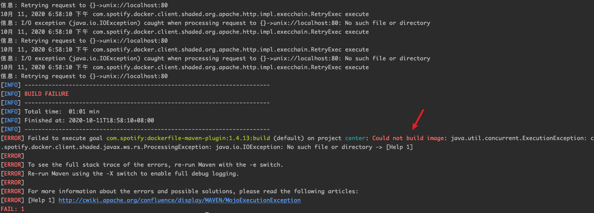
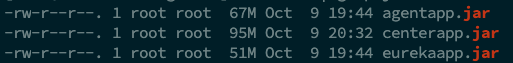

# 魔方-MagiCude 开发说明

by [贰拾壹](https://github.com/er10yi )

## 前言

本文仅从前后端开发工具及软件，配置修改，环境搭建，jar包导出及dist文件生成，部署包创建等方面介绍，不涉及具体架构说明及功能实现，如有更好的意见，欢迎一起讨论~

**理论上所有软件都可以用最新的版本，反正开发的时候一直都是这么操作的 >.<**

相关文章：

1. 《魔方-MagiCude，不仅仅是资产安全管理系统》：https://mp.weixin.qq.com/s/S4eXM849ExH9Z7-T_Ls2RQ
2. 《魔方-MagiCude，开源了》：https://mp.weixin.qq.com/s/NlMAtWj6H9C5jsbKLe6WWg
3. GitHub页面上的说明文档
4. 最新部署包：https://github.com/er10yi/MagiCude/releases

## 所需软件及配置修改

### 后端

| 软件           | 说明                                                         |
| -------------- | ------------------------------------------------------------ |
| idea 2020.2.2  | 下载链接https://www.jetbrains.com/idea/download/             |
| jdk 15         | 下载链接http://jdk.java.net/15/ 或者 https://mirrors.huaweicloud.com/openjdk/15/ |
| maven 3.6.3    | 需要设置本地库，并增加阿里云仓库，见下文说明                 |
| docker 1.13.1  | CentOS中用于安装redis、mysql、nginx、rabbitmq                |
| postman        | 没写前端时用来做接口测试 T-T相当苦逼                         |
| PowerDesigner  | 设计数据库，PD图就不放出来了                                 |
| Navicat        | 数据库操作                                                   |
| VM             | 安装CentOS开发测试服务器，需提前安装CentOS 7.x               |
| Termius        | SSH连接                                                      |
| WinSCP         | Windows远程文件管理                                          |
| Cyberduck      | Mac远程文件管理                                              |
| CentOS 7.8     | 部署开发测试环境的服务器，可用部署脚本来搭建环境             |
| redis 6.0.1    | 服务器安装，部署脚本自动安装                                 |
| mysql 8.0.21   | 服务器安装，部署脚本自动安装                                 |
| nginx 1.19.3   | 服务器安装，部署脚本自动安装                                 |
| rabbitmq 3.8.9 | 服务器安装，部署脚本自动安装                                 |
| JEP            | https://github.com/ninia/jep，Java执行Python插件代码，本地安装，见下文说明 |
| python 3.9     | 需要安装JEP，Mac和Windows下安装JEP方式不一样，见下文说明     |
| nmap           | 本地手动安装                                                 |
| masscan        | 本地手动安装                                                 |

**maven配置文件settings.xml修改**

1. 设置本地库

   ```xml
   <localRepository>D:\maven\turkey</localRepository>
   ```

2. ```<mirrors>```节点增加阿里云仓库

   ```xml
   <!-- 阿里云仓库 -->
       <mirror>
           <id>alimaven</id>
           <mirrorOf>central</mirrorOf>
           <name>aliyun maven</name>
           <url>https://maven.aliyun.com/repository/central</url>
       </mirror>
    
       <!-- 中央仓库1 -->
       <mirror>
           <id>repo1</id>
           <mirrorOf>central</mirrorOf>
           <name>maven repo1</name>
           <url>http://repo1.maven.org/maven2/</url>
       </mirror>
    
       <!-- 中央仓库2 -->
       <mirror>
           <id>repo2</id>
           <mirrorOf>central</mirrorOf>
           <name>maven repo2</name>
           <url>http://repo2.maven.org/maven2/</url>
       </mirror>
   ```


### 前端

**当前只完成管理后台，用户前台未写**

mock接口数据省略，因为前后端都是自己写的，再mock数据感觉太麻烦了

管理后台脚手架 https://github.com/PanJiaChen/vue-admin-template
部分依赖已升级并增加其他依赖，详情见 package.json

| 软件及插件         | 说明                                   |
| ------------------ | -------------------------------------- |
| node 14.10.0       | node.js下载链接 https://nodejs.org/en/ |
| VUE                |                                        |
| echarts            | 折线图，饼图                           |
| Visual Studio Code | 下载链接https://code.visualstudio.com/ |
| Color Picker       | vscode插件，需手动安装                 |
| ESLint             | vscode插件，需手动安装                 |
| HTML CSS Support   | vscode插件，需手动安装                 |
| HTML Snippets      | vscode插件，需手动安装                 |
| Vetur              | vscode插件，需手动安装                 |
| VueHelper          | vscode插件，需手动安装                 |
| NPM-Scripts        | vscode插件，需手动安装                 |
| vscode-icons       | vscode图标插件，需手动安装，可选       |

**vscode配置**

vscode配置文件参考，打开命令面板，搜索 open settings.json，按需修改，主要是为了保存时能自动格式化代码

```json
{
    "editor.suggestSelection": "first",
    "vsintellicode.modify.editor.suggestSelection": "automaticallyOverrodeDefaultValue",
    "files.autoSave": "off",
    "workbench.colorTheme": "Monokai Dimmed",
    "editor.renderWhitespace": "all",
    "editor.renderControlCharacters": true,
    "java.errors.incompleteClasspath.severity": "ignore",
    "python.jediEnabled": false,
    "files.exclude": {
        "**/.classpath": true,
        "**/.project": true,
        "**/.settings": true,
        "**/.factorypath": true
    },
    "editor.minimap.enabled": false,
    "workbench.activityBar.visible": true,
    "breadcrumbs.enabled": false,
    "window.zoomLevel": 0,

    "eslint.autoFixOnSave": true,
    "eslint.validate": [
    "javascript",
    "javascriptreact",
    {
        "language": "html",
        "autoFix": true
    },
    {
        "language": "vue",
        "autoFix": true
    }
    ],
    "editor.codeActionsOnSave": {
        "source.fixAll.eslint": true
    },
    "git.enableSmartCommit": true
}
```

## 开发

### 搭建开发测试环境

1. 前往releases页面下载最新的部署包 https://github.com/er10yi/MagiCude 
2. VM中的CentOS按照README文档部署好（**agent.yml、center.yml、eureka.yml三个文件后面会用到**）
3. VM中的CentOS上```/root/MagiCude/operation```目录下执行```sh stopCenterService.sh```停止MagiCude服务

此时，所需软件```redis、mysql、nginx、rabbitmq```都在服务器上运行，本地不再需要安装

### 后端

1. 本地安装nmap、masscan

2. 本地配置JDK环境

3. 本地安装Python3.9

4. 本地安装[JEP](https://github.com/ninia/jep)

   * Mac下：

   ```shell
   pip3 install wheel -i https://pypi.douban.com/simple/
   pip3 install jep -i https://pypi.douban.com/simple/
   ```
   * Windows下：需要先安装[Microsoft Visual C++ Build Tools 2015](http://go.microsoft.com/fwlink/?LinkId=691126 )（默认安装即可)，[来源参考](https://blog.csdn.net/weixin_40547993/article/details/89399825 )）

   ```shell
   pip3 install wheel -i https://pypi.douban.com/simple/
   pip3 install jep -i https://pypi.douban.com/simple/
   ```

   jep也在```site-packages/jep```下，名称为```jep.dll```

5. 后端项目clone到本地 https://github.com/er10yi/MagiCude，使用idea导入，修改jdk、python、maven相关信息

   * **非常重要：本机运行时，需要将agent、center、eureka的的pom.xml文件的resources标签注释掉，否则将没有对应的运行配置文件；如果导出成jar包，需要把resources标签加回来**

     ```xml
     <resources>
         <resource>
             <directory>src/main/resources</directory>
             <excludes>
                 <exclude>application.yml</exclude>
             </excludes>
         </resource>
     </resources>
     ```

   * 将agent.yml、center.yml、eureka.yml三个文件使用部署包生成的替换

   * 修改替换后的agent.yml，```absolutePath:```修改成第三步中的绝对路径（注意key之后有个空格）；```httpValidateApi:```修改ip成本地非127.0.0.1的ip；```dnsValidateIp:```修改ip成本地非127.0.0.1的ip

   * 修改替换后的agent.yml、center.yml，将redis、mysql、rabbitmq的ip都修改成CentOS服务器的ip（**eureka相关的不用改**）

6. 等maven依赖下载完成后，按照```EurekaApplication -> CenterApplication -> AgentApplication```顺序启动

此时后端项目已成功运行，可以用postman测试，不过前端都写好了，就没必要这么折腾了

### 前端

1. 前端项目clone到本地 https://github.com/er10yi/MagiCude-admin

2. 在终端打开，执行```npm install```安装本地依赖
3. 使用VSCode打开，并执行npm脚本dev，编译完后，浏览器会自动打开页面
4. 使用上述步骤生成部署包时newPass.txt中的密码登录即可
5. 此时，如果修改前端文件，前端会直接加载

## 三个jar包导出

原本打算使用docker私服，自动化搞定编译导出上传啥的，后面懒得弄了，jar包导出还是用docker，jar需要手动上传到目标服务器

**注意：** 需要先到plugin目录执行```mvn install```将plugin包安装到本地maven的库，如果java插件修改，也要执行相同操作，然后才能 ```mvn clean package dockerfile:build```

eureka、center、agent三个都是使用docker，Dockerfile见各根目录

1. **需要将agent、center、eureka的pom.xml文件的resources标签加回来，否则jar包中会包含配置文件**

2. 在各根目录分别执行```mvn clean package dockerfile:build``` 

   由于没有配置私服的地址，执行命令时会报错

   

   jar包大小正常就可以，输出的jar包在根目录的target文件夹下，注意文件大小

   

## dist文件生成

VSCode使用npm脚本```build:prod```生成dist文件

**远端部署或仅更新前端**

1. 将服务器```MagiCude```下的dist文件夹删除
2. 将生成的dist文件夹复制到服务器
3. 手动修改api地址：```sed -i "s/127.0.0.1/服务器的实际ip/g" root/MagiCude/dist/static/js/app.*.js```
4. 重启nginxApp：```docker start nginxApp```


## 部署包创建

**1.下载最新部署包环境**

前往 https://github.com/er10yi/MagiCude/tree/master/deploy 下载最新的部署包环境

**2.替换前端dist**

1. 删除```deploy/MagiCude```下的dist文件夹
2. 将新的dist文件夹复制到```deploy/MagiCude```下

**3.复制新的jar包到MagiCude目录下**

将生成的三个jar包：eurekaapp.jar、centerapp.jar、agentapp.jar复制到```deploy/MagiCude```目录下

此时部署包创建完成，可手动下载```openjdk-15_linux-x64_bin.tar.gz```到```deploy/MagiCude```目录下，减少部署时间

## 其他

如果新功能涉及数据库调整或配置文件修改，则需要根据实际修改部署包环境

## 微信讨论组

如有任何问题，欢迎群里反馈

扫描下方二维码，关注公众号，回复**自己的微信号+魔方**，即刻拥有！

